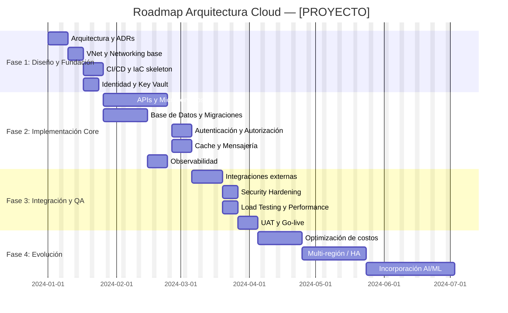

# Fases de Implementación y Roadmap

> Referencia del skill `arquitecto-cloud`. Cargar cuando el usuario solicite roadmap, fases de implementación, plan de migración o planificación evolutiva de arquitectura.

---

## Marco de Fases Estándar

Todo diseño arquitectónico se estructura en 4 fases progresivas. Las fases 1–3 constituyen la **primera iteración** (MVP a producción). La fase 4 y siguientes evolucionan el sistema.

```
┌─────────────────────────────────────────────────────────────────────┐
│  Fase 1        │  Fase 2         │  Fase 3         │  Fase 4+       │
│  Diseño y      │  Implementación │  Integración    │  Evolución /   │
│  Fundación     │  Core           │  y QA           │  Roadmap       │
│  (Sem 1–4)     │  (Sem 5–12)     │  (Sem 13–16)    │  (Sem 17+)     │
└─────────────────────────────────────────────────────────────────────┘
```

---

## Fase 1: Diseño y Fundación

### Objetivos
- Validar la arquitectura seleccionada con stakeholders.
- Configurar fundaciones de infraestructura (redes, identidad, CI/CD).
- Definir estándares de naming, tagging, seguridad y monitoreo.

### Entregables

| Entregable | Descripción |
|------------|-------------|
| Documento de Arquitectura | Opciones A/B/C con diagramas Mermaid y tabla comparativa |
| ADRs (Architecture Decision Records) | Registro de decisiones de proveedor, servicio y patrón |
| VNet / Networking base | Subnets, NSGs, Private Endpoints configurados |
| Identidad y Accesos | Entra ID / IAM roles con principio de mínimo privilegio |
| Repositorios y CI/CD skeleton | Pipelines GitHub Actions / Azure DevOps base con stages |
| IaC base | Terraform / Bicep con módulos para servicios fundacionales |
| Estándares de logging | Log Analytics Workspace + Application Insights configurados |

### Criterio de Éxito (Definition of Done)
- [ ] Arquitectura aprobada por el equipo técnico y sponsor
- [ ] Entorno de desarrollo desplegado correctamente
- [ ] Pipeline CI/CD ejecutando builds y tests
- [ ] Secrets en Key Vault (0 credenciales en código)
- [ ] README de arquitectura en el repositorio

### Riesgos Fase 1

| Riesgo | Probabilidad | Impacto | Mitigación |
|--------|-------------|---------|-----------|
| Cambio de requisitos tardío | Alta | Alto | Fijar scope del MVP, usar ADRs |
| Curva de aprendizaje del equipo | Media | Medio | Capacitación paralela, pair programming |
| Costos de red subestimados | Baja | Medio | Usar Azure Pricing Calculator desde día 1 |

---

## Fase 2: Implementación Core

### Objetivos
- Desplegar servicios de backend, base de datos y APIs.
- Implementar autenticación, autorización y seguridad en capas.
- Establecer observabilidad completa (logs, métricas, alertas).

### Entregables

| Entregable | Descripción |
|------------|-------------|
| APIs REST / GraphQL | Servicios desplegados en Container Apps / App Service |
| Base de Datos | PostgreSQL / Cosmos DB / SQL configurado con migraciones |
| Autenticación | Entra ID / Firebase Auth integrado, tokens JWT validados |
| Cache | Redis configurado con TTL policies por tipo de dato |
| Mensajería | Service Bus / Event Hubs configurado con dead-letter queues |
| Storage | Blob Storage con lifecycle policies y acceso seguro (SAS/Managed Identity) |
| Observabilidad | Dashboard Azure Monitor + alertas críticas configuradas |
| Tests E2E | Suite de pruebas de integración en pipeline CI/CD |

### Estrategias de Despliegue Recomendadas

| Estrategia | Cuándo Usar |
|------------|-------------|
| **Blue-Green** | Producción crítica, rollback inmediato requerido |
| **Canary Release** | Validar cambios con % pequeño de usuarios antes de full rollout |
| **Rolling Update** | Kubernetes / Container Apps con múltiples réplicas |
| **Feature Flags** | Separar deploy de release, habilitación gradual |

### Criterio de Éxito (Definition of Done)
- [ ] Todos los endpoints clave documentados en OpenAPI/Swagger
- [ ] Tests unitarios cobertura ≥ 80%
- [ ] Tests de integración ejecutando en CI/CD
- [ ] Monitoreo con alertas configuradas (P95 latencia, error rate, disponibilidad)
- [ ] Security scan en pipeline (SAST/DAST)

### Riesgos Fase 2

| Riesgo | Probabilidad | Impacto | Mitigación |
|--------|-------------|---------|-----------|
| Deuda técnica acumulada | Alta | Alto | Code reviews obligatorios, definition of done estricto |
| Performance inesperada | Media | Alto | Load testing temprano (k6 / Azure Load Testing) |
| Costos superando estimado | Media | Medio | Presupuesto Azure con alertas de costo, tagging de recursos |
| Integraciones de terceros fallando | Media | Medio | Circuit breakers, retries, mock en tests |

---

## Fase 3: Integración y QA

### Objetivos
- Integrar todos los sistemas externos (Firebase, MongoDB Atlas, servicios legacy).
- Ejecutar performance testing, security testing y UAT.
- Preparar runbooks y documentación operacional.
- Hacer hardening de seguridad antes de producción.

### Entregables

| Entregable | Descripción |
|------------|-------------|
| Integraciones completas | Firebase Auth, MongoDB Atlas, APIs externas conectadas |
| Security Hardening Report | OWASP Top 10 auditado, CVEs críticos resueltos |
| Performance Test Results | Load test con usuarios concurrentes objetivo |
| Runbook Operacional | Guía de operaciones, escalación, troubleshooting |
| Disaster Recovery Plan | RPO/RTO definidos, procedimiento de restore documentado |
| UAT Sign-off | Aprobación del usuario final / product owner |
| Go-live Checklist | Lista de verificación pre-producción |

### Go-Live Checklist

```markdown
## Pre-Producción Checklist

### Seguridad
- [ ] No secrets en código (verificado con git-secrets / trufflehog)
- [ ] Todos los endpoints autenticados / autorizados
- [ ] HTTPS forzado, TLS 1.2+ mínimo
- [ ] Rate limiting configurado en API Gateway
- [ ] WAF habilitado (Front Door / Application Gateway)
- [ ] Key Vault con acceso via Managed Identity (no connection strings)
- [ ] Backup habilitado para todas las bases de datos
- [ ] Private Endpoints para servicios PaaS críticos

### Operaciones
- [ ] Alertas críticas configuradas y testeadas
- [ ] On-call rotation definido
- [ ] Runbook de incidentes documentado
- [ ] Proceso de rollback probado en staging
- [ ] DR drill ejecutado

### Performance
- [ ] Load test aprobado con usuarios concurrentes objetivo
- [ ] Auto-scaling configurado y testeado
- [ ] CDN habilitado para assets estáticos
- [ ] Queries de base de datos optimizadas (índices verificados)
```

### Criterio de Éxito (Definition of Done)
- [ ] Todos los ítems del Go-live Checklist aprobados
- [ ] Sign-off del cliente/product owner
- [ ] Equipo de operaciones capacitado
- [ ] Runbook publicado en wiki del proyecto

---

## Fase 4+: Evolución y Roadmap

### Objetivos de la Fase 4 y más allá
- Escalar el sistema basado en métricas reales de producción.
- Incorporar nuevas funcionalidades sin romper lo existente.
- Optimizar costos (Reserved Instances, auto-scale policies).
- Explorar mejoras: IA, observabilidad avanzada, multi-región.

### Áreas de Evolución Típicas

| Área | Evolución Posible |
|------|-------------------|
| **Escala** | Multi-región activo-activo, global load balancing |
| **Datos** | Separar lectura/escritura (CQRS), event sourcing |
| **Observabilidad** | Distributed tracing completo, AIOps con Azure Monitor |
| **AI/ML** | Agregar Azure OpenAI, recomendaciones, detección de anomalías |
| **Seguridad** | Zero Trust, mTLS entre microservicios, SIEM con Sentinel |
| **Costo** | Reserved Instances 1/3 años, Spot para batch, escala a cero |
| **DevOps** | GitOps con Flux/ArgoCD, platform engineering |

---

## Plantilla de Roadmap Visual (Mermaid Gantt)



---

## Plantilla de Roadmap por Trimestre

| Trimestre | Fase | Objetivo Principal | KPI de Éxito |
|-----------|------|-------------------|--------------|
| Q1 | Fase 1 + inicio Fase 2 | Fundación + primer API en producción | Ambiente prod activo, CI/CD verde |
| Q2 | Fase 2 completo | Backend completo, integrado y monitorizado | 99.5% uptime, <200ms P95 latencia |
| Q3 | Fase 3 | Producción hardened, integraciones activas | UAT aprobado, 0 CVEs críticos |
| Q4 | Fase 4 | Optimización, escala, primera evolución | -20% costo mensual, +1 feature estratégico |

---

## ADR — Architecture Decision Record Template

```markdown
# ADR-[NÚMERO]: [Título de la Decisión]

**Fecha**: [YYYY-MM-DD]
**Estado**: [Propuesto | Aceptado | Rechazado | Reemplazado]

## Contexto
[Descripción del problema o necesidad que motiva esta decisión]

## Decisión
[La decisión tomada]

## Opciones Consideradas
1. **[Opción A]**: [Descripción breve] — Pros: ... / Contras: ...
2. **[Opción B]**: [Descripción breve] — Pros: ... / Contras: ...
3. **[Opción C]**: [Descripción breve] — Pros: ... / Contras: ...

## Consecuencias
- **Positivas**: [Beneficios esperados]
- **Negativas**: [Trade-offs aceptados]
- **Riesgos**: [Riesgos residuales]
```
