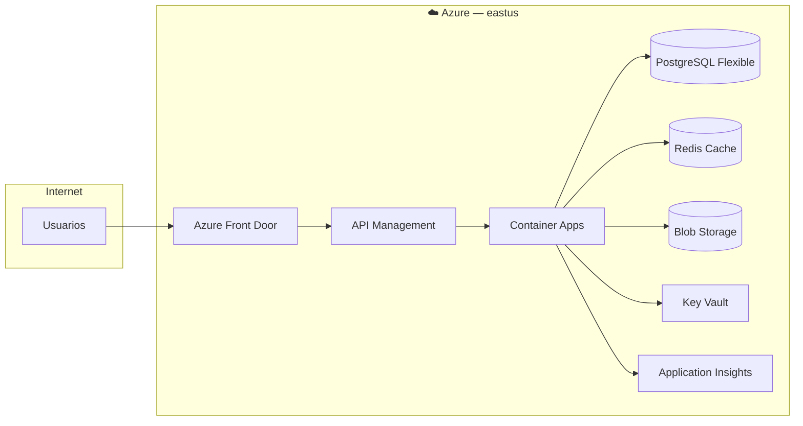
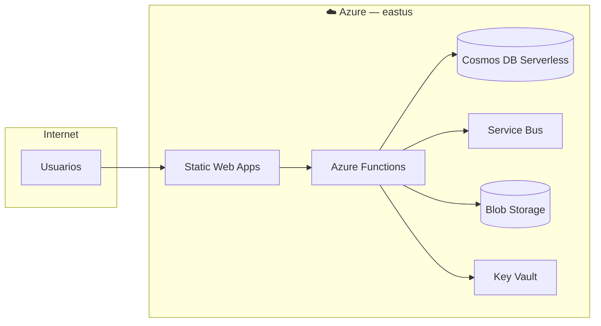
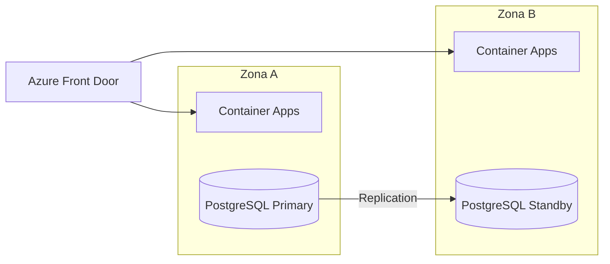
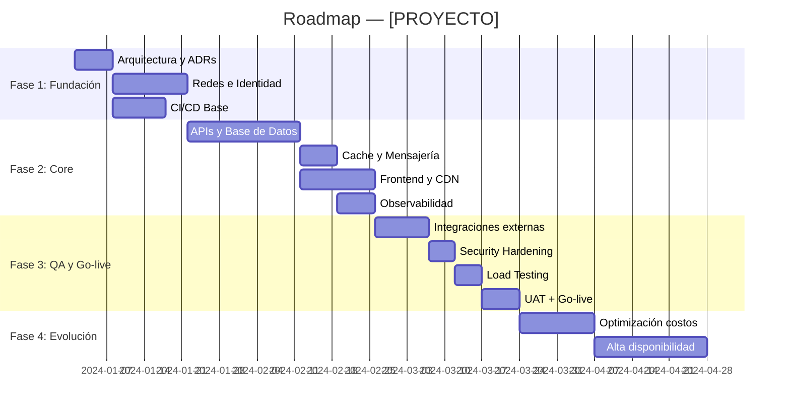

# Plantilla de Documento de Arquitectura Cloud

> Esta plantilla es usada por el skill `arquitecto-cloud` para generar el archivo de salida Markdown.
> Nombre del archivo: `ARQ-<PROYECTO>-<PROVEEDOR>-<YYYYMMDD>.md`

---

# Arquitectura Cloud — [NOMBRE DEL PROYECTO]

**Empresa / Cliente**: [Nombre]
**Versión**: 1.0
**Fecha**: [DD de mes de YYYY]
**Proveedor Principal**: [Azure / AWS / GCP / Multi-cloud]
**Preparado por**: Arquitecto Cloud Expert (GitHub Copilot)

---

## Resumen Ejecutivo

[2–4 párrafos describiendo el sistema, el problema que resuelve, la escala objetivo y la decisión
arquitectónica principal. Incluir por qué se eligió el proveedor y el patrón.]

---

## Supuestos

> Todo lo que no fue provisto explícitamente por el usuario se declara aquí.

| # | Supuesto | Impacto si es Incorrecto |
|---|----------|--------------------------|
| 1 | [Ej: 1,000 usuarios concurrentes como pico] | Cambia sizing de cómputo y cache |
| 2 | [Ej: Pay-as-you-go, sin reservas] | Costo podría reducirse 40% con reservas |
| 3 | [Ej: Región eastus (Azure) como primaria] | Afecta latencia para usuarios LATAM |
| 4 | | |

---

## Contexto del Sistema

### Dominios Principales
- [Dominio 1]: [descripción breve]
- [Dominio 2]: [descripción breve]

### Requisitos No Funcionales

| Requisito | Valor Objetivo |
|-----------|---------------|
| Usuarios Concurrentes | [X] |
| Disponibilidad (SLA) | [99.X%] |
| Latencia P95 | [< X ms] |
| RPO (Recovery Point Objective) | [X horas] |
| RTO (Recovery Time Objective) | [X horas] |
| Región Principal | [eastus / sa-east-1 / etc.] |
| Cumplimiento | [GDPR / SOC2 / ISO 27001 / ninguno] |

---

## Opción A — [Nombre de la Opción A]

> **Perfil**: Estándar gestionado. Menor complejidad operacional.

### Diagrama de Arquitectura

### Servicios — Opción A

| # | Servicio | Proveedor | SKU | Región | Costo Est./mes |
|---|----------|-----------|-----|--------|----------------|
| 1 | [Servicio] | [Azure/AWS/GCP] | [SKU] | [Región] | $[X] |
| 2 | | | | | |
| | | | | **TOTAL** | **$[X]** |

### Pros y Contras — Opción A

| Pros ✅ | Contras ❌ |
|---------|----------|
| [Pro 1] | [Contra 1] |
| [Pro 2] | [Contra 2] |

**Complejidad Operacional**: Baja | Media | Alta
**Time-to-Market**: Rápido | Medio | Lento
**Recomendado para**: [MVP / Startup / Crecimiento / Enterprise]

---

## Opción B — [Nombre de la Opción B]

> **Perfil**: Optimizada en costo. Servicios serverless y pay-per-use.

### Diagrama de Arquitectura

### Servicios — Opción B

| # | Servicio | Proveedor | SKU | Región | Costo Est./mes |
|---|----------|-----------|-----|--------|----------------|
| 1 | | | | | |
| | | | | **TOTAL** | **$[X]** |

### Pros y Contras — Opción B

| Pros ✅ | Contras ❌ |
|---------|----------|
| [Pro 1] | [Contra 1] |

**Complejidad Operacional**: Baja | Media | Alta

---

## Opción C — [Nombre de la Opción C]

> **Perfil**: Alta disponibilidad / Resiliente. SLA ≥ 99.9%, multi-zona o multi-región.

### Diagrama de Arquitectura

### Servicios — Opción C

| # | Servicio | Proveedor | SKU | Región | Costo Est./mes |
|---|----------|-----------|-----|--------|----------------|
| 1 | | | | | |
| | | | | **TOTAL** | **$[X]** |

### Pros y Contras — Opción C

| Pros ✅ | Contras ❌ |
|---------|----------|
| [Pro 1] | [Contra 1] |

**Complejidad Operacional**: Alta

---

## Tabla Comparativa de Opciones

| Criterio | Opción A | Opción B | Opción C |
|----------|----------|----------|----------|
| **Costo Mensual Est.** | $[X] | $[X] | $[X] |
| **Costo Anual Est.** | $[X] | $[X] | $[X] |
| **Complejidad Operacional** | Baja | Media | Alta |
| **Escalabilidad** | Media | Alta | Alta |
| **Time-to-Market** | Rápido | Medio | Lento |
| **SLA Estimado** | 99.5% | 99.9% | 99.99% |
| **Costo Ingeniería Setup** | Bajo | Bajo | Alto |
| **Adecuado para escala** | 1–500 users | 500–50K users | 50K+ users |
| **Recomendado para** | MVP/Inicio | Crecimiento | Enterprise |

---

## Fases de Implementación

### Fase 1 — Diseño y Fundación (Semanas 1–4)

| Semana | Actividad | Responsable | Entregable |
|--------|-----------|-------------|-----------|
| 1 | Validación de requisitos y ADRs | Arquitecto + PO | ADRs firmados |
| 1–2 | VNet, subnets, NSG, Key Vault | DevOps | IaC en repositorio |
| 2–3 | CI/CD pipelines base | DevOps | Pipeline verde en staging |
| 3–4 | Identidad (Entra ID / Auth) | Backend + DevOps | Auth funcional |

### Fase 2 — Implementación Core (Semanas 5–12)

| Semana | Actividad | Responsable | Entregable |
|--------|-----------|-------------|-----------|
| 5–7 | APIs principales y base de datos | Backend | APIs documentadas |
| 7–9 | Cache, mensajería y storage | Backend + DevOps | Servicios configurados |
| 9–11 | Frontend y CDN | Frontend | App desplegada |
| 11–12 | Observabilidad y alertas | DevOps | Dashboard activo |

### Fase 3 — Integración y QA (Semanas 13–16)

| Semana | Actividad | Responsable | Entregable |
|--------|-----------|-------------|-----------|
| 13 | Integraciones externas | Backend | APIs terceros conectadas |
| 13–14 | Security hardening | Security + DevOps | Security report verde |
| 14–15 | Load testing | QA + DevOps | Reporte de performance |
| 15–16 | UAT y Go-live | QA + PO | Sign-off, producción activa |

### Fase 4 — Evolución / Roadmap (Semana 17+)

| Milestone | Objetivo | Tiempo Est. |
|-----------|----------|-------------|
| Optimización de costos | Reserved Instances, auto-scale | +4 semanas |
| Alta Disponibilidad | Multi-zona, DR activo | +6 semanas |
| AI / Features avanzados | Azure OpenAI, search, analytics | +8 semanas |

---

## Roadmap Visual

---

## Riesgos y Mitigaciones

| Riesgo | Probabilidad | Impacto | Mitigación | Responsable |
|--------|-------------|---------|-----------|-------------|
| [Riesgo 1] | Alta / Media / Baja | Alto / Medio / Bajo | [Acción] | [Rol] |
| Costos superiores al estimado | Media | Medio | Budget alerts en Azure, revisión mensual | DevOps |
| Rendimiento insuficiente | Media | Alto | Load testing en Fase 3, auto-scaling desde día 1 | Arquitecto |
| Brecha de seguridad | Baja | Crítico | WAF, Managed Identity, Key Vault, SAST en CI | Security |

---

## Recomendación Final

> **Opción Recomendada**: [A / B / C]

**Justificación**: [2–3 párrafos explicando por qué esta opción es la más adecuada para el contexto
del proyecto, el equipo y el presupuesto disponible. Mencionar qué opciones son válidas para fases
futuras cuando el sistema escale.]

**Próximos Pasos**:
1. [ ] Aprobar arquitectura con el equipo y sponsor
2. [ ] Crear repositorio y configurar IaC con estructura Terraform/Bicep
3. [ ] Provisionar entorno de desarrollo (Fase 1, Semana 1)
4. [ ] Kickoff de la Fase 2 tras validación de fundación

---

## Referencias

| Recurso | URL |
|---------|-----|
| Azure Architecture Center | https://learn.microsoft.com/en-us/azure/architecture/ |
| Azure Well-Architected Framework | https://learn.microsoft.com/en-us/azure/well-architected/ |
| Azure Pricing Calculator | https://azure.microsoft.com/es-es/pricing/calculator/ |
| AWS Documentation | https://docs.aws.amazon.com/ |
| GCP Architecture Center | https://cloud.google.com/architecture |
| MongoDB Atlas Docs | https://www.mongodb.com/docs/atlas/ |
| Firebase Documentation | https://firebase.google.com/docs |
| Railway Documentation | https://docs.railway.app/ |

---

*Generado con skill `arquitecto-cloud` — GitHub Copilot · [FECHA]*
