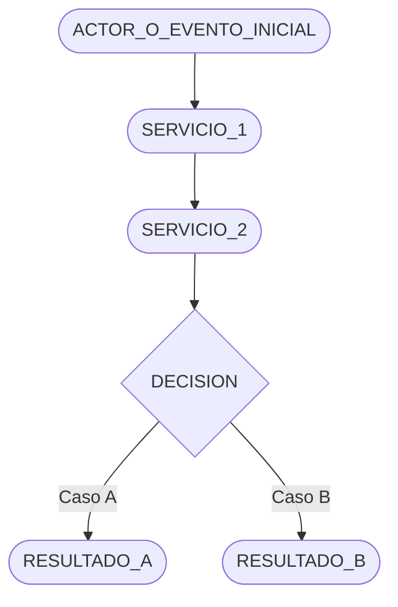
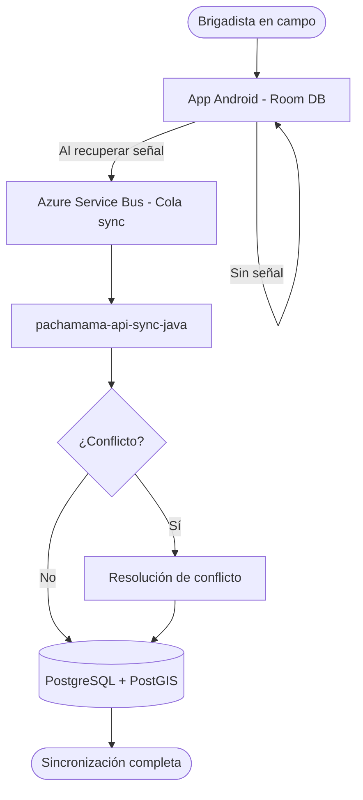

> Plantilla del skill `pachamama-docs` — Flujo Arquitectónico

---

```markdown
# [NOMBRE_DEL_FLUJO]

[Párrafo introductorio: Describir qué proceso representa este flujo, qué servicios participan,
y desde qué evento inicia hasta qué resultado produce.]

---

## Diagrama de [NOMBRE_DEL_FLUJO]



<!-- 
  Tipos de nodo Mermaid:
    A([texto])    ← Inicio / Fin (redondeado)
    B[texto]      ← Proceso / Servicio
    C{texto}      ← Decisión
    D[(texto)]    ← Base de datos
    E>texto]      ← Evento externo
-->

---

## Resumen Operativo

1. **[Paso 1]:** [Descripción del paso — quién hace qué].
2. **[Paso 2]:** [Descripción del paso].
3. **[Paso 3]:** [Descripción del paso].
4. **[Paso N]:** [Resultado final].

---

## Notas Técnicas

- **[Nota 1]:** [Detalle técnico relevante sobre el flujo, ej: timeout, retry, idempotencia].
- **[Nota 2]:** [Otra nota técnica].

<!-- Si no hay notas técnicas adicionales, eliminar esta sección -->

---

## Servicios Involucrados

| Servicio | Rol en el flujo |
|----------|----------------|
| [SERVICIO_1] | [Descripción del rol] |
| [SERVICIO_2] | [Descripción del rol] |

<!-- Agregar fila por cada servicio que participe en el flujo -->
```

---

## Campos Obligatorios

| Campo | Notas |
|-------|-------|
| `# <Nombre del Flujo>` | Nombre descriptivo del flujo |
| Párrafo introductorio | Contexto del flujo y servicios involucrados |
| `## Diagrama de <Nombre>` | Diagrama Mermaid obligatorio |
| `## Resumen Operativo` | Pasos numerados del flujo |
| `## Servicios Involucrados` | Tabla de servicios con su rol |

## Campos Opcionales

- `## Notas Técnicas` — Para detalles de implementación relevantes
- `## Casos de Error` — Para flujos con manejo de errores documentado
- `## Configuración Requerida` — Para flujos dependientes de configuración específica

---

## Ejemplo de Flujo Completo — Sincronización Offline

```markdown
# Sincronización Offline

La app Android registra actividades en campo sin conexión a internet.
Cuando detecta conectividad, envía los datos pendientes a través de
`Azure Service Bus`, procesados por `pachamama-api-sync-java` para su
persistencia en `PostgreSQL + PostGIS`.

---

## Diagrama de Sincronización Offline



## Resumen Operativo

1. **Registro offline:** El brigadista registra actividades en la app Android; los datos se  
   guardan localmente en Room DB.
2. **Detección de conectividad:** WorkManager detecta cuando el dispositivo recupera  
   acceso a internet.
3. **Envío a Service Bus:** La app publica los registros pendientes en la cola de Azure  
   Service Bus.
4. **Procesamiento:** `pachamama-api-sync-java` consume los mensajes y los valida.
5. **Resolución de conflictos:** Si hay conflictos con registros ya existentes, se aplica  
   la estrategia de resolución configurable.
6. **Persistencia:** Los registros se insertan/actualizan en PostgreSQL + PostGIS con  
   sus coordenadas GPS.

## Notas Técnicas

- **Idempotencia:** Cada mensaje de sincronización incluye un `syncId` UUID para  
  garantizar procesamiento exactamente-una-vez.
- **Retry:** Si el procesamiento falla, el mensaje vuelve a la cola con dead-letter  
  después de 3 intentos.

## Servicios Involucrados

| Servicio | Rol en el flujo |
|----------|----------------|
| pachamama-mobile-android | Genera y envía los mensajes de sincronización |
| Azure Service Bus | Cola de mensajes con garantía de entrega |
| pachamama-api-sync-java | Consume y procesa los mensajes, persiste datos |
| PostgreSQL + PostGIS | Almacenamiento final de datos geoespaciales de campo |
```
