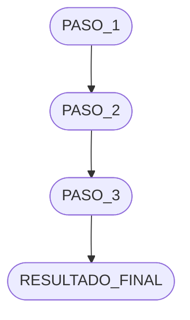

> Plantilla del skill `pachamama-docs` — Gestión de Cambios: `index.md`

---

```markdown
# Gestión de Cambios: [OBSERVACION_O_FEATURE] — [NOMBRE_DEL_CAMBIO]

## Registro de Cambios

---

## [[DD Mmm] – [DD Mmm YYYY]] [NOMBRE_CORTO_DEL_CAMBIO]

**Autor:** [NOMBRE_AUTOR]
**Período:** [DD] de [Mes] – [DD] de [Mes] [YYYY] *([N] días)*
**APK generada:** `v[X.Y.Z]`

<!-- Omitir línea "APK generada" si no hubo cambio en pachamama-mobile-android -->

**Objetivo:** [DESCRIPCION_DEL_OBJETIVO — qué observación o feature se cumple con este cambio]

### Contexto

[Párrafo 1: Describir la situación previa al cambio, el problema detectado o la observación registrada.]

[Párrafo 2 (opcional): Detalle adicional del contexto, sub-problemas numerados si aplica.]

> **Observación #N:** [Texto exacto de la observación si viene de un ticket o registro]

---

### Componentes Modificados

| Componente | Versión | Descripción del Cambio |
|---|---|---|
| [[NOMBRE_SERVICIO_1]]([SERVICIO_1].md) | `v[X.Y.Z-ANTES]` → `v[X.Y.Z-DESPUES]` | [Descripción breve del cambio en este servicio] |
| [[NOMBRE_SERVICIO_2]]([SERVICIO_2].md) | `v[X.Y.Z-ANTES]` → `v[X.Y.Z-DESPUES]` | [Descripción breve del cambio en este servicio] |

<!-- Agregar una fila por cada servicio afectado. Si no hubo cambio de versión, indicar v[X.Y.Z] → v[X.Y.Z] (sin cambio). -->

---

### Flujo del Cambio — [NOMBRE_DEL_FLUJO]



<!-- Adaptar el diagrama Mermaid al flujo real del cambio. Usar flowchart TD para flujos de proceso. -->

---

### Particularidades [Técnicas / de Negocio]

[Detalles técnicos adicionales relevantes para este cambio que no encajan en las secciones anteriores.]

- **[Aspecto técnico 1]:** [Detalle]
- **[Aspecto técnico 2]:** [Detalle]

<!-- Si no hay particularidades, eliminar esta sección -->
```

---

## Campos Obligatorios

| Campo | Obligatorio | Notas |
|-------|-------------|-------|
| Título (`#`) | ✅ | Observación/feature + nombre del cambio |
| Período | ✅ | Rango de fechas con duración en días |
| Autor | ✅ | Nombre completo del autor del cambio |
| APK generada | Solo si mobile fue afectado | Versión semver del APK |
| Objetivo | ✅ | Una oración que resume el propósito |
| Contexto | ✅ | Al menos un párrafo |
| Componentes Modificados | ✅ | Tabla con todos los servicios afectados |
| Flujo del Cambio | ✅ | Diagrama Mermaid representando el flujo |

## Campos Opcionales

- `Particularidades Técnicas` — Solo si hay detalles técnicos adicionales relevantes
- Sub-secciones adicionales de contexto (ej. `### Antecedentes`)

## Ejemplo de Tabla de Componentes con Varios Servicios

```markdown
| Componente | Versión | Descripción del Cambio |
|---|---|---|
| [Mobile Android](pachamama-mobile-android.md) | `v1.2.0` → `v1.2.1` | Nueva pantalla de permisos bloqueados |
| [API Admin](pachamama-api-admin-java.md) | `v3.1.0` → `v3.1.1` | Nuevo endpoint de validación OTP |
| [API Notificaciones](pachamama-api-notifications-java.md) | `v2.0.0` → `v2.0.1` | Integración Twilio WA OTP |
| [Admin Web](pachamama-admin-web.md) | `v1.5.0` → `v1.5.1` | Panel de permisos bloqueados |
```
