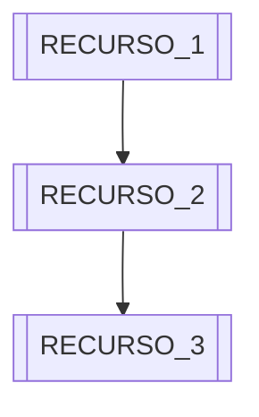

> Plantilla del skill `pachamama-docs` — Infraestructura de Proveedor

---

```markdown
# [NOMBRE_PROVEEDOR] ([AMBIENTE: MVP / Pre-Producción / Producción])

[Párrafo introductorio: Rol del proveedor en la arquitectura Pachamama, qué servicios lo usan y para qué.]

---

## Detalles de Cuenta y Entorno

| Campo | Valor |
|-------|-------|
| Cuenta / Tenant | [email o ID de cuenta] |
| Plan / Suscripción | [nombre del plan] |
| Región principal | [región] |
| ID de Suscripción / Proyecto | [ID si aplica] |
| Costo mensual estimado | ~$[N] USD |

---

## Topología de Recursos



<!-- Adaptar el diagrama Mermaid a los recursos reales del proveedor -->

---

## Servicios Activos

| Recurso | SKU / Plan | Propósito | Costo / Notas |
|---------|-----------|-----------|---------------|
| [NOMBRE_RECURSO_1] | [SKU o plan] | [Para qué se usa] | [Costo o notas] |
| [NOMBRE_RECURSO_2] | [SKU o plan] | [Para qué se usa] | [Costo o notas] |

---

## Configuración Relevante

```
[Configuración técnica relevante del proveedor:
 - Connection strings (sin credenciales)
 - Variables de entorno clave
 - Reglas de firewall / CORS
 - Quotas de servicio
 - Cualquier configuración no obvia]
```

---

## Servicios del Sistema que lo Usan

| Servicio Pachamama | Cómo lo usa |
|-------------------|-------------|
| [SERVICIO_1] | [Descripción de uso] |
| [SERVICIO_2] | [Descripción de uso] |

---

## Notas de Mantenimiento

- [Nota 1: Algo relevante para operaciones o migraciones futuras.]
- [Nota 2: Ej: "Este proveedor se migrará a Azure en Julio 2026"]

<!-- Si no hay notas de mantenimiento relevantes, eliminar esta sección -->
```

---

## Secciones Obligatorias

| Sección | Notas |
|---------|-------|
| `# <Proveedor> (<Ambiente>)` | Siempre incluir el ambiente |
| Párrafo introductorio | Rol del proveedor en la arquitectura |
| Detalles de Cuenta | Siempre, pero sin credenciales en texto plano |
| Servicios Activos | Tabla de recursos con SKU y propósito |

## Secciones Opcionales

| Sección | Cuándo incluirla |
|---------|-----------------|
| Topología de Recursos | Cuando hay múltiples recursos relacionados entre sí |
| Configuración Relevante | Cuando hay configuración no obvia o importante para el equipo |
| Servicios del Sistema que lo Usan | Siempre que sea relevante para entender dependencias |
| Notas de Mantenimiento | Para planes de migración, quotas, o advertencias operativas |

---

## Ejemplos por Proveedor

### Azure (`azure.md`)

```markdown
# Azure (Pre-Producción → Corporativo en 2026)

Azure es el proveedor cloud principal del sistema Pachamama para componentes
serverless y mensajería. Actualmente bajo cuenta personal; la migración al 
tenant corporativo `pachamamadev@pachamaxter.onmicrosoft.com` está planificada
para junio de 2026.

## Detalles de Cuenta y Entorno

| Campo | Valor |
|-------|-------|
| Tenant corporativo | pachamamadev@pachamaxter.onmicrosoft.com |
| Suscripción objetivo | Azure for Business (brazilsouth) |
| Resource Group prd | rg-pachamama-prd-eastus |
| Costo mensual actual | ~$2 USD |

## Servicios Activos

| Recurso | SKU / Plan | Propósito | Costo |
|---------|-----------|-----------|-------|
| Azure Functions (x2) | Consumption | SAS tokens + Trace Sync | ~$0 |
| Azure Blob Storage | LRS | Almacenamiento de fotos de campo | ~$1 |
| Azure Service Bus | Standard | Cola de sincronización + Topic trazabilidad | ~$1 |
| Azure Cosmos DB | Free tier | ReadModel CQRS (trazabilidad) | $0 |
```

### Heroku (`heroku.md`)

```markdown
# Heroku (Pre-Producción)

Heroku hospeda las 4 APIs Java del sistema Pachamama en ambiente productivo
previa a la migración a Azure App Service planificada para julio de 2026.

## Detalles de Cuenta y Entorno

| Campo | Valor |
|-------|-------|
| Cuenta | [cuenta-heroku] |
| Plan | Basic (Standard 1X dynos) |
| Región | us |
| Costo mensual | ~$80 USD |

## Servicios Activos

| App Heroku | Servicio Pachamama | Plan | Costo |
|-----------|-------------------|------|-------|
| pachamama-api-admin | pachamama-api-admin-java | Basic $7/mes | $7 |
| pachamama-api-sync | pachamama-api-sync-java | Basic $7/mes | $7 |
| pachamama-api-notifications | pachamama-api-notifications-java | Standard 2X | $25 |
| pachamama-api-trace | pachamama-api-trace-java | Basic $7/mes | $7 |
```

### Railway (`railway.md`)

```markdown
# Railway (Pre-Producción)

Railway hospeda la base de datos principal del sistema: PostgreSQL 16 con
extensión PostGIS para almacenamiento de datos geoespaciales de campo.

## Detalles de Cuenta y Entorno

| Campo | Valor |
|-------|-------|
| Plan | Hobby |
| Región | us-west1 |
| Costo mensual | ~$5 USD |

## Servicios Activos

| Recurso | Engine | Propósito | Notas |
|---------|--------|-----------|-------|
| PostgreSQL 16 | PostgreSQL 16 + PostGIS | Datos de campo + geometrías GPS | Migración → Azure Flexible Server ago 2026 |
```
