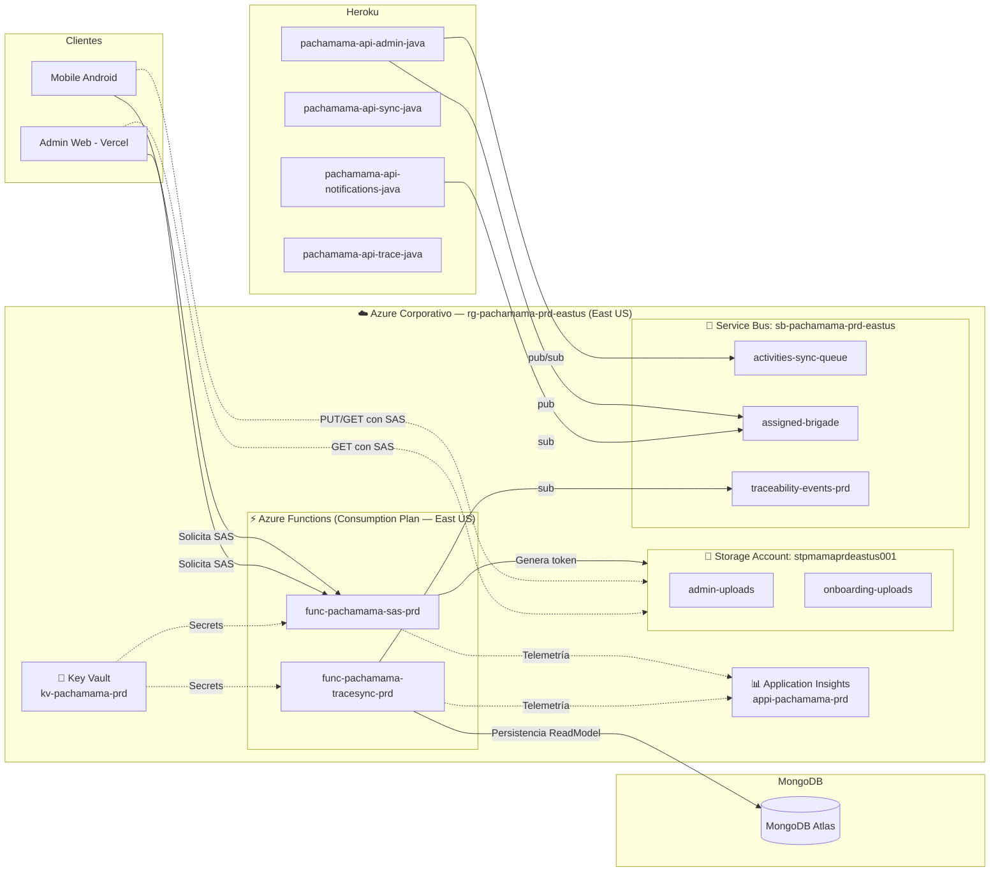
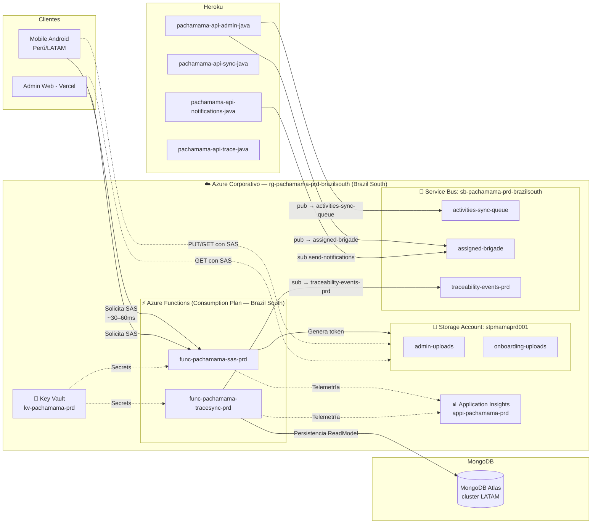
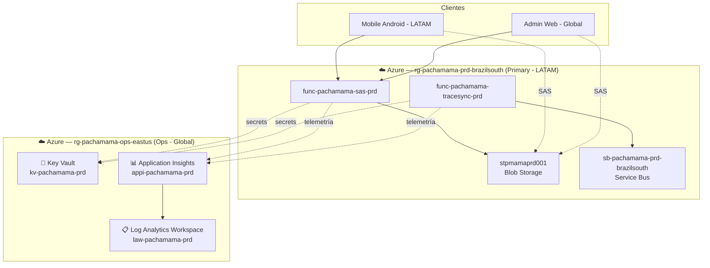
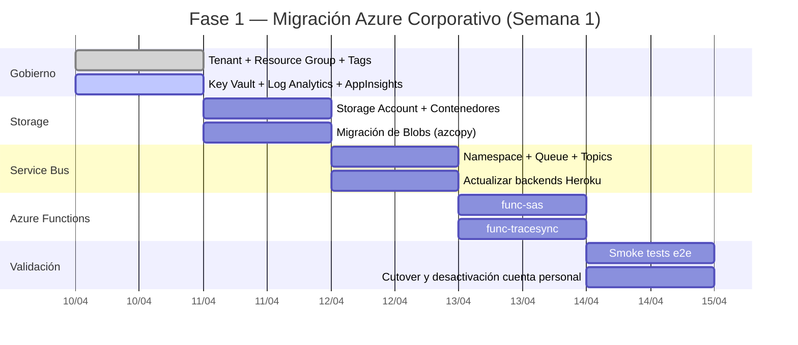

# Arquitectura Cloud — Pachamama: Fase 1 — Migración Azure Corporativo

**Empresa / Cliente**: Pachamama (Pachamaxter)  
**Versión**: 1.0  
**Fecha**: 10 de Abril de 2026  
**Proveedor Principal**: Microsoft Azure  
**Preparado por**: Arquitecto Cloud Expert (GitHub Copilot)  
**Alcance**: Fase 1 — Lift & Shift de recursos Azure desde cuenta personal a Tenant Corporativo

---

## Resumen Ejecutivo

Pachamama opera actualmente con una arquitectura MVP híbrida multi-cloud. Los servicios serverless y de almacenamiento en Azure (Azure Functions y Blob Storage) fueron aprovisionados bajo una cuenta personal (`jecridosantos@outlook.com`, Tenant `codeoncube`), mientras que los backends principales residen en Heroku y las bases de datos en Railway y MongoDB Atlas.

La **Fase 1** tiene un objetivo delimitado y concreto: realizar el "Lift & Shift" de los recursos Azure existentes hacia el Tenant corporativo (`pachamamadev@pachamaxter.onmicrosoft.com`), aplicando la nomenclatura del Azure Cloud Adoption Framework y estableciendo las bases de gobierno, seguridad y observabilidad que soportarán las fases siguientes.

Este documento presenta **tres opciones** para ejecutar dicha migración, diferenciándose principalmente en la región de despliegue, la estrategia de red y el nivel de gobierno aplicado desde el inicio. La recomendación final es la **Opción B (Brazil South optimizada)**, que resuelve la restricción de cuota de Dynamic VMs detectada en `eastus`, reduce latencia para usuarios en Latinoamérica y se alinea con la región donde ya opera el Service Bus.

Los recursos de terceros (Heroku, Railway, MongoDB Atlas, Firebase, Vercel) **no son modificados en esta fase** y continúan operando sin interrupción.

---

## Supuestos

| # | Supuesto | Impacto si es Incorrecto |
|---|----------|--------------------------|
| 1 | La suscripción corporativa (`pachamaxter`) tiene cuota de Dynamic VMs ≥ 1 en la región seleccionada | Si no, debe solicitarse aumento de cuota o cambiar región antes de crear Functions |
| 2 | Las Functions `pachamama-func-sas-node` y `pachamama-func-trace-sync` no requieren modificaciones de código, solo re-despliegue con nuevas variables de entorno | Si el código tiene hardcoding de recursos, habrá refactorización adicional |
| 3 | El plan de consumo (Consumption Y1) es suficiente para la carga actual del MVP | Si hay picos de concurrencia sostenidos, podría necesitarse plan Premium EP1 |
| 4 | El Service Bus actual (`pachamama-sync-batch`, region `brazilsouth`) es reutilizado temporalmente durante la transición | Si se requiere recrear el Service Bus en la cuenta corporativa, hay riesgo de pérdida de mensajes en tránsito |
| 5 | Los secretos de conexión (Storage Account Key, Service Bus Connection String) son gestionados vía variables de entorno en las Functions | Permite migración sin cambios en los backends Heroku |
| 6 | Pay-as-you-go sin reservas en Fase 1 (carga baja de MVP/pre-producción) | Las reservas reducirían hasta 40% en Fase 3 (producción plena) |
| 7 | Equipo de 1–2 personas con experiencia básica en Azure Portal (sin experiencia profunda en IaC) | La complejidad de Terraform/Bicep puede requerir capacitación en fases posteriores |

---

## Contexto del Sistema

### Estado Actual — Recursos Azure en Cuenta Personal

| Recurso | Nombre Actual | Cuenta | Región |
|---------|--------------|--------|--------|
| Resource Group | `rg-pachamama` | codeoncube (jecridosantos@outlook.com) | eastus |
| Storage Account | `sapachamama001` | codeoncube | eastus |
| Azure Function SAS | `pachamama-func-sas-node` | codeoncube | eastus (Plan Dynamic) |
| Azure Function Trace | `pachamama-func-trace-sync` | codeoncube | eastus (Plan Dynamic) |
| Service Bus | `pachamama-sync-batch` | codeoncube | brazilsouth |

### Recursos a crear en Cuenta Corporativa

| Recurso | Nombre Nuevo (CAF) | Cuenta Destino | Notas |
|---------|-------------------|----------------|-------|
| Resource Group | `rg-pachamama-prd-eastus` o `rg-pachamama-prd-brazilsouth` | pachamaxter | Según opción elegida |
| Storage Account | `stpmamaprdeastus001` o `stpmamaprd001` | pachamaxter | Max 24 chars, solo minúsculas |
| Azure Function SAS | `func-pachamama-sas-prd` | pachamaxter | Nuevo Consumption Plan |
| Azure Function Trace | `func-pachamama-tracesync-prd` | pachamaxter | Nuevo Consumption Plan |
| Service Bus | `sb-pachamama-prd-brazilsouth` | pachamaxter | Migrar o reciclar |
| Key Vault | `kv-pachamama-prd` | pachamaxter | **Nuevo**: centralizar secretos |
| Application Insights | `appi-pachamama-prd` | pachamaxter | **Nuevo**: observabilidad |

### Dominios Principales Afectados
- **Almacenamiento seguro de archivos**: SAS Token generation para admin-uploads y onboarding-uploads
- **Sincronización de trazabilidad**: ReadModel sync desde Service Bus hacia MongoDB
- **Mensajería asíncrona**: Colas y tópicos para sincronización de actividades y notificaciones

### Requisitos No Funcionales (Fase 1)

| Requisito | Valor Objetivo |
|-----------|---------------|
| Disponibilidad Functions | ≥ 99.5% (Consumption Plan SLA) |
| Latencia SAS Generation P95 | < 500 ms |
| Tiempo de migración total | ≤ 5 días hábiles |
| Interrupción de servicio aceptable | Ventana de 30 min (horario no pico) |
| Región Principal (LATAM) | brazilsouth (recomendado) o eastus |
| Secrets en código | 0 — todos en Key Vault o App Settings cifrados |
| RPO (si hay fallo durante migración) | 0 — los datos están en Storage/Service Bus, no en Functions |

---

## Restricción Detectada — Cuota East US

> **⚠️ Alerta:** La suscripción actual presenta `Current Limit (Dynamic VMs): 0` en `eastus`.  
> Esto bloquea la creación de Azure Functions con Consumption Plan en esa región.

**Opciones para resolverlo:**

| Acción | Tiempo | Complejidad | Riesgo |
|--------|--------|-------------|--------|
| Solicitar aumento de cuota en eastus (portal → Quotas → Dynamic VMs → Request increase) | 5–30 min | Baja | Bajo (proceso automático en cuentas verificadas) |
| Migrar a `brazilsouth` (sin cuota adicional, LATAM) | Inmediato | Baja | Bajo |
| Usar `eastus2` como alternativa a eastus | Inmediato | Baja | Bajo |
| Cambiar a plan Premium EP1 (no usa Dynamic VMs) | Inmediato | Media | +$~75/mes por Function |

Las tres opciones arquitectónicas propuestas se diferencian en cómo abordan esta restricción.

---

## Opción A — Lift & Shift Directo a East US

> **Perfil**: Replicar la arquitectura actual en la misma región (eastus), en la cuenta corporativa. Requiere solicitar aumento de cuota primero.

### Diagrama de Arquitectura



### Servicios — Opción A

| # | Servicio | SKU | Región | Costo Est./mes |
|---|----------|-----|--------|----------------|
| 1 | Azure Functions (SAS) | Consumption Y1 | East US | ~$0–5 |
| 2 | Azure Functions (Trace Sync) | Consumption Y1 | East US | ~$0–5 |
| 3 | Storage Account (Blob) | Standard LRS GPv2 | East US | ~$2–5 |
| 4 | Service Bus | Standard Tier | East US | ~$10 |
| 5 | Key Vault | Standard | East US | ~$1–3 |
| 6 | Application Insights | Pay-per-use | East US | ~$0–5 |
| | | | **TOTAL Est.** | **~$13–33/mes** |

### Pros y Contras — Opción A

| Pros ✅ | Contras ❌ |
|---------|----------|
| Mantiene toda la infra en una sola región | **Requiere solicitar aumento de cuota** antes de iniciar |
| Coherencia con naming del ROADMAP actual | Mayor latencia para usuarios en Perú/LATAM vs. BrazilSouth |
| Migración 1:1 simple de entender | Service Bus actual está en brazilsouth → red cruzada entre regiones |
| eastus es la región Azure más madura y con más servicios disponibles | Latencia SAS request desde Android (Peru → East US) ~120–180 ms vs ~30–60 ms Brazil |

**Complejidad Operacional**: Baja  
**Time-to-Market**: Medio (depende del tiempo de aprobación de cuota)  
**Recomendado para**: Si el equipo ya tiene aprobada la cuota o necesita consistencia con la región de futuros recursos (Fase 3 en eastus)

---

## Opción B — Migración a Brazil South (Recomendada)

> **Perfil**: Desplegar en `brazilsouth`, misma región del Service Bus activo, menor latencia LATAM, sin restricción de cuota. Estrategia óptima para la carga actual.

### Diagrama de Arquitectura



### Servicios — Opción B

| # | Servicio | SKU | Región | Costo Est./mes |
|---|----------|-----|--------|----------------|
| 1 | Azure Functions (SAS) | Consumption Y1 | Brazil South | ~$0–5 |
| 2 | Azure Functions (Trace Sync) | Consumption Y1 | Brazil South | ~$0–5 |
| 3 | Storage Account (Blob) | Standard LRS GPv2 | Brazil South | ~$3–6 |
| 4 | Service Bus | Standard Tier | Brazil South | ~$10 |
| 5 | Key Vault | Standard | Brazil South | ~$1–3 |
| 6 | Application Insights | Pay-per-use (Log Analytics) | Brazil South | ~$0–5 |
| | | | **TOTAL Est.** | **~$14–34/mes** |

> Nota: Los precios en Brazil South son ~5–10% más altos que eastus, pero la reducción de costos de
> red (latencia y transferencia de datos entre regiones) compensa la diferencia para cargas LATAM.

### Pros y Contras — Opción B

| Pros ✅ | Contras ❌ |
|---------|----------|
| **No requiere aumento de cuota** — desplegable inmediatamente | Brazil South tiene disponibilidad de SKUs premium más limitada para Fase 3 |
| Misma región que Service Bus actual → mínima latencia interna | Algunos servicios de Fase 3 (ACA, Cosmos DB) pueden tener lag de disponibilidad en SA |
| Latencia SAS desde Peru/LATAM: ~30–60 ms vs ~140 ms en eastus | Storage ~5% más caro que eastus |
| Migración 1:1 del Service Bus sin riesgo de mensajes en tránsito | Zona horaria (UTC-3) puede afectar alertas nocturnas según configuración del equipo |
| Alineado con posición geográfica de los recolectores de campo | |
| Cumplimiento de residencia de datos LATAM | |

**Complejidad Operacional**: Baja  
**Time-to-Market**: Rápido (inicio inmediato, sin bloqueos de cuota)  
**Recomendado para**: MVP pre-producción con usuarios en Perú/LATAM y equipo pequeño

---

## Opción C — Dual Region con Key Vault Centralizado

> **Perfil**: Despliegue primario en `brazilsouth` + Key Vault y Application Insights en `eastus`. Añade resiliencia básica sin llegar a multi-región completo. Ideal si se prevé tráfico desde usuarios de EE.UU. o Europa en Fase 3.

### Diagrama de Arquitectura



### Servicios — Opción C

| # | Servicio | SKU | Región | Costo Est./mes |
|---|----------|-----|--------|----------------|
| 1 | Azure Functions (SAS) | Consumption Y1 | Brazil South | ~$0–5 |
| 2 | Azure Functions (Trace Sync) | Consumption Y1 | Brazil South | ~$0–5 |
| 3 | Storage Account (Blob) | Standard GRS GPv2 *(geo-redundante)* | Brazil South | ~$5–10 |
| 4 | Service Bus | Standard Tier | Brazil South | ~$10 |
| 5 | Key Vault | Standard | East US | ~$1–3 |
| 6 | Application Insights + Log Analytics | Pay-per-use | East US | ~$3–10 |
| | | | **TOTAL Est.** | **~$19–43/mes** |

### Pros y Contras — Opción C

| Pros ✅ | Contras ❌ |
|---------|----------|
| Centralización de observabilidad en eastus (región ops estándar) | Mayor complejidad de gestión (2 resource groups) |
| GRS en Storage → réplica automática en región par | +$5–10/mes vs Opción B |
| Fundación para multi-región en Fase 3 sin re-arquitectura | Key Vault en eastus agrega ~20–40 ms a cada secret read desde brazilsouth (mitigable con caché) |
| Log Analytics en eastus facilita integración futura con Azure Sentinel | Requiere entender RBAC cross-region desde el inicio |

**Complejidad Operacional**: Media  
**Time-to-Market**: Medio  
**Recomendado para**: Si se planea Fase 3 (producción plena) en los próximos 3–4 meses

---

## Tabla Comparativa de Opciones

| Criterio | Opción A — East US | Opción B — Brazil South ⭐ | Opción C — Dual Region |
|----------|-------------------|--------------------------|----------------------|
| **Costo Mensual Est.** | ~$13–33 | ~$14–34 | ~$19–43 |
| **Bloqueo de Cuota** | ⚠️ Sí — requiere request previo | ✅ No | ✅ No |
| **Latencia LATAM (P95)** | ~120–180 ms | ~30–60 ms | ~30–60 ms |
| **Complejidad Operacional** | Baja | Baja | Media |
| **Time-to-Market** | Medio | Rápido | Medio |
| **Resiliencia de Datos** | LRS (simple) | LRS (simple) | GRS (geo-redundante) |
| **Observabilidad** | Application Insights básico | Application Insights básico | App Insights + Log Analytics centralizado |
| **Alineación con Service Bus actual** | ❌ Region cruzada | ✅ Misma región | ✅ Misma región |
| **Recomendado para** | Equipos con cuota aprobada | MVP/pre-producción LATAM | Transición a PRD planificada |
| **Preparación para Fase 3** | Alta (eastus es la región estándar del roadmap) | Media (puede requerir migración a eastus en Fase 3) | Alta |

---

## Nomenclatura Final Aplicada (CAF — Opción B)

Basada en el [Azure Cloud Adoption Framework](https://learn.microsoft.com/en-us/azure/cloud-adoption-framework/ready/azure-best-practices/resource-naming):

| Recurso | Nombre | Notas |
|---------|--------|-------|
| Resource Group | `rg-pachamama-prd-brazilsouth` | Contenedor de todos los recursos de la fase |
| Storage Account | `stpmamaprd001` | ≤24 chars, solo minúsculas, sin guiones |
| Contenedor Blob | `admin-uploads` | Sin cambio |
| Contenedor Blob | `onboarding-uploads` | Sin cambio |
| Azure Function SAS | `func-pachamama-sas-prd` | Runtime: Node.js 18+ |
| App Service Plan (SAS) | `plan-pachamama-sas-prd` | Consumption Y1 |
| Azure Function Trace | `func-pachamama-tracesync-prd` | Runtime: Node.js 18+ |
| App Service Plan (Trace) | `plan-pachamama-tracesync-prd` | Consumption Y1 |
| Service Bus Namespace | `sb-pachamama-prd-brazilsouth` | SKU Standard |
| Queue | `activities-sync-queue` | Sin cambio |
| Topic | `assigned-brigade` | Sin cambio |
| Topic | `traceability-events-prd` | Renombrar de `-dev` a `-prd` |
| Key Vault | `kv-pachamama-prd` | Soft-delete habilitado |
| Application Insights | `appi-pachamama-prd` | Vinculado a Log Analytics Workspace |
| Log Analytics Workspace | `law-pachamama-prd` | Retención 30 días (free tier) |

---

## Fases de Implementación — Fase 1

### Paso 1 — Preparación y Gobierno (Día 1)

| Actividad | Responsable | Herramienta |
|-----------|-------------|-------------|
| Crear Tenant corporativo si no existe (`pachamaxter.onmicrosoft.com`) | Admin Azure | Azure Portal |
| Crear suscripción y asignar a grupo de facturación | Admin Azure | Azure Portal |
| Crear Resource Group `rg-pachamama-prd-brazilsouth` | DevOps | Azure CLI |
| Crear Key Vault `kv-pachamama-prd` con RBAC habilitado | DevOps | Azure Portal / CLI |
| Crear Log Analytics Workspace `law-pachamama-prd` | DevOps | Azure Portal |
| Crear Application Insights `appi-pachamama-prd` | DevOps | Azure Portal |
| Definir tags de recursos: `project=pachamama`, `env=prd`, `phase=1` | DevOps | Azure Policy (opcional) |

```bash
# Ejemplo Azure CLI — Crear Resource Group
az login --tenant pachamaxter.onmicrosoft.com
az group create \
  --name rg-pachamama-prd-brazilsouth \
  --location brazilsouth \
  --tags project=pachamama env=prd phase=1
```

### Paso 2 — Storage Account y Contenedores (Día 1–2)

| Actividad | Notas |
|-----------|-------|
| Crear Storage Account `stpmamaprd001` en brazilsouth | Standard LRS, HTTPs only, TLS 1.2 mínimo |
| Crear contenedor `admin-uploads` con acceso privado | Sin acceso público anónimo |
| Crear contenedor `onboarding-uploads` con acceso privado | Sin acceso público anónimo |
| Exportar archivos desde `sapachamama001` (cuenta personal) | Usar `azcopy sync` para migrar blobs existentes |
| Guardar Storage Connection String en Key Vault | Secret: `storage-connection-string-prd` |

```bash
# Ejemplo: migración de blobs con AzCopy
azcopy sync \
  "https://sapachamama001.blob.core.windows.net/admin-uploads?<SAS-SOURCE>" \
  "https://stpmamaprd001.blob.core.windows.net/admin-uploads?<SAS-DEST>" \
  --recursive
```

### Paso 3 — Service Bus (Día 2)

| Actividad | Notas |
|-----------|-------|
| Crear Service Bus namespace `sb-pachamama-prd-brazilsouth` en brazilsouth | SKU Standard |
| Crear Queue `activities-sync-queue` | Max size 1GB, lock duration 60s, dead-letter on expiry |
| Crear Topic `assigned-brigade` + Suscripción `send-notifications` | Filter: sin filtro (todo) |
| Crear Topic `traceability-events-prd` + Suscripción `landing-readmodel-sync-prd` | Renombrar de `-dev` a `-prd` |
| Guardar Primary Connection String en Key Vault | Secret: `servicebus-connection-string-prd` |
| Actualizar variable de entorno en backends Heroku | `AZURE_SERVICEBUS_CONNECTION_STRING` |

> **Nota de migración en caliente**: Mantener `pachamama-sync-batch` (cuenta personal) activo durante 24–48 horas después de migrar las funciones, para procesar mensajes en tránsito antes de apagar.

### Paso 4 — Azure Functions (Día 3)

| Actividad | Notas |
|-----------|-------|
| Crear Function App `func-pachamama-sas-prd` | Runtime Node.js 18, Consumption Y1, brazilsouth |
| Habilitar Application Insights en la Function | Vincular a `appi-pachamama-prd` |
| Configurar App Settings desde Key Vault (Key Vault References) | `@Microsoft.KeyVault(SecretUri=...)` |
| Desplegar código desde repositorio GitHub | GitHub Actions o Azure Functions Core Tools |
| Crear Function App `func-pachamama-tracesync-prd` | Runtime Node.js 18, Consumption Y1, brazilsouth |
| Configurar trigger Service Bus en `func-pachamama-tracesync-prd` | Apuntar a `traceability-events-prd` |
| Smoke test: invocar `func-pachamama-sas-prd` y validar SAS Token generado | cURL o Postman |

```json
// App Settings recomendados para func-pachamama-sas-prd
{
  "AzureWebJobsStorage": "@Microsoft.KeyVault(SecretUri=https://kv-pachamama-prd.vault.azure.net/secrets/storage-connection-string-prd/)",
  "APPINSIGHTS_INSTRUMENTATIONKEY": "<appi-key>",
  "STORAGE_ACCOUNT_NAME": "stpmamaprd001",
  "STORAGE_CONTAINER_ADMIN": "admin-uploads",
  "STORAGE_CONTAINER_ONBOARDING": "onboarding-uploads"
}
```

### Paso 5 — Validación y Cutover (Día 4–5)

| Actividad | Criterio de Éxito |
|-----------|------------------|
| Validar generación de SAS Token desde app Android en staging | Token válido, archivo subido/leído correctamente en nuevo Storage |
| Validar flujo de trazabilidad end-to-end | Evento publicado en topic → Function procesa → ReadModel actualizado en MongoDB |
| Validar sincronización de actividades | Mensaje en queue → API Sync procesa correctamente |
| Actualizar URLs de Functions en backends Heroku | Variables `FUNC_SAS_URL`, `FUNC_TRACESYNC_URL` |
| Desactivar Functions en cuenta personal (no eliminar aún) | Mantener 7 días por precaución |
| Revocar accesos de cuenta personal al Service Bus | Política de mínimo privilegio |

---

## Roadmap Visual — Fase 1



---

## Riesgos y Mitigaciones

| # | Riesgo | Probabilidad | Impacto | Mitigación |
|---|--------|-------------|---------|-----------|
| 1 | Cuota Dynamic VMs insuficiente en la región elegida | Alta (detectada en eastus) | Alto — bloquea creación de Function | Usar brazilsouth (Opción B) o solicitar aumento de cuota con anticipación |
| 2 | Mensajes perdidos durante migración del Service Bus | Media | Alto — actividades de recolectores sin sincronizar | Mantener el namespace anterior activo 48h como fallback; migrar en horario de baja actividad |
| 3 | Blobs migrados con permisos incorrectos | Baja | Alto — app Android no puede subir archivos | Validar permisos de contenedores post-migración con smoke test antes del cutover |
| 4 | Variables de entorno desactualizadas en Heroku | Media | Alto — Functions apuntando a cuenta anterior | Checklist de variables por servicio; validar en staging antes de cutover |
| 5 | Key Vault References mal configuradas en Functions | Baja | Medio — Function no arranca | Probar con un secret simple antes de migrar todos; tener fallback en App Settings directos temporalmente |
| 6 | Costos inesperados por tráfico cross-region | Baja | Bajo-Medio | Activar alertas de costo en suscripción desde día 1 ($50 threshold) |
| 7 | Tiempo de aprobación de cuota mayor al esperado (Opción A) | Media | Bloqueante | Plan B: usar brazilsouth inmediatamente mientras se espera aprobación |

---

## Definition of Done — Fase 1

- [ ] Resource Group creado en cuenta corporativa con tags correctos
- [ ] Storage Account `stpmamaprd001` operativo, contenedores creados, blobs migrados
- [ ] Key Vault configurado, todos los secretos almacenados (0 secretos en código o App Settings en texto plano)
- [ ] Service Bus namespace corporativo con todas las colas y tópicos recreados
- [ ] `func-pachamama-sas-prd` desplegada, respondiendo y generando SAS tokens válidos
- [ ] `func-pachamama-tracesync-prd` desplegada, procesando eventos del topic correctamente
- [ ] Application Insights recibiendo telemetría de ambas Functions
- [ ] Backends en Heroku actualizados apuntando a nuevos recursos corporativos
- [ ] Smoke test end-to-end validado desde app Android (staging)
- [ ] Functions en cuenta personal desactivadas (no eliminadas)
- [ ] Documentación de variables de entorno actualizada en repositorio privado

---

## Recomendación Final

**Opción B — Brazil South** es la estrategia recomendada para la Fase 1 por las siguientes razones:

1. **Desbloqueada inmediatamente**: Evita el bloqueo de cuota de Dynamic VMs detectado en eastus, permitiendo iniciar la migración hoy mismo.
2. **Menor latencia para usuarios**: Los recolectores de campo en Perú y LATAM experimentarán tiempos de respuesta 2–3x mejores al generar tokens SAS desde un servidor en São Paulo vs. Virginia.
3. **Coherencia con Service Bus activo**: El namespace `pachamama-sync-batch` ya está en brazilsouth, reduciendo el riesgo de la migración al mantener el mismo datacenter para mensajería y Functions.
4. **Costo equivalente**: La diferencia de ~5% en precio de Storage no modifica materialmente el presupuesto a esta escala.

**Ajuste para Fase 3**: Si el roadmap de producción plena (Fase 3) se ejecuta en eastus como indica el documento `ROADMAP-MIGRATION-PRD.md`, se deberá planificar una segunda migración de región en ese momento. Alternativamente, considerar la **Opción C** si la Fase 3 está dentro del horizonte de los próximos 3 meses.

---

## Referencias

| Recurso | URL |
|---------|-----|
| Azure Cloud Adoption Framework — Naming | https://learn.microsoft.com/en-us/azure/cloud-adoption-framework/ready/azure-best-practices/resource-naming |
| Azure Functions Consumption Plan | https://learn.microsoft.com/en-us/azure/azure-functions/consumption-plan |
| Azure Functions — Cuotas y Límites | https://learn.microsoft.com/en-us/azure/azure-functions/functions-scale#service-limits |
| AzCopy — Migración de Blobs | https://learn.microsoft.com/en-us/azure/storage/common/storage-use-azcopy-v10 |
| Key Vault References en Functions | https://learn.microsoft.com/en-us/azure/app-service/app-service-key-vault-references |
| Azure Service Bus — Standard Tier | https://learn.microsoft.com/en-us/azure/service-bus-messaging/service-bus-premium-messaging |
| Solicitar aumento de cuota (Quotas) | https://portal.azure.com/#blade/Microsoft_Azure_Capacity/QuotaMenuBlade/myQuotas |
| Azure Pricing Calculator | https://azure.microsoft.com/en-us/pricing/calculator/ |
