# Arquitectura MVP Pachamama (Pre-Producción)

Esta es la documentación técnica y arquitectónica del estado actual del proyecto MVP, operando como un ambiente de **Pre-Producción**. 

## Diagrama de Arquitectura

```mermaid
flowchart LR
  %% === Sección: Desplegado actualmente ===
  subgraph deployed[Arquitectura Pachamama]
    subgraph frontend[Front]

      APP[pachamama-mobile-android]

      subgraph vercel[Vercel]
        WEB[pachamama-web-admin]
        LANDING[pachamama-web-landing in progress]
      end     
      
    end

    subgraph backend[Back]

      subgraph heroku[Heroku]
        API[pachamama-api-admin-java]
        API2[pachamama-api-sync-java]
        API3[pachamama-api-notifications-java]
        API4[pachamama-api-trace-java]
      end
      subgraph azure[Azure]

        subgraph azure-function[Azure Functions]
             SASFUNC[pachamama-func-sas-node]
             TRACEFUNC[pachamama-func-trace-sync]
        end
        subgraph azure-storage[Azure Storage]
             BLOB[(Account: sapachamama001)]
        end
        subgraph service-bus[Service Bus]
            subgraph pachamama-sync-batch[pachamama-sync-batch]
                queue1[activities-sync-queue]
                topic1[assigned-brigade]
                topic2[traceability-events-dev]
            end
        end
      end

      subgraph railway[Railway]
            PG[(PostgreSQL + PostGIS)]
      end

      subgraph cache[Caché]
            DBR[(REDIS)]
      end

      subgraph atlas[Atlas DB]
            MDB[(MongoDB)]
      end

      subgraph firebase[Firebase]
        FAUTH[Authentication]
        MESS[Messaging]
      end

    end

    subgraph external[Recursos externos]
      PERUDEV[https://api.perudevs.com/api/v1/]

      TWILIO[Verify OTP]
    end
 
  end


  %% === Flujos principales ===
  WEB -- REST --> API
  WEB -- Solicita SAS Lectura --> SASFUNC
  LANDING -- REST --> API4

  WEB -- Login --> FAUTH

  APP -- REST --> API
  APP -- REST --> API3
  API -- Carga: admin-uploads --> BLOB
  API -- Validación Token --> FAUTH

  %% Web obtiene SAS para visualizar/subir archivos

  APP -- Solicita SAS Lectura/Escritura --> SASFUNC
  SASFUNC -- Genera SAS (Lectura/Escritura) --> BLOB
  WEB -. GET con SAS .-> BLOB
  APP -. GET/PUT con SAS .-> BLOB

  API2 -- pub/sub --> queue1

  APP -- REST --> API2

  API2 -- Persistencia async --> PG
  API -- Persistencia --> DBR
  API3 -- Persistencia: pachamama_notifications --> MDB
  API4 -- Solo lectura: pachamama_traceability_readmodel_dev  --> MDB

  API -- send/verify OTP --> TWILIO
  API3 -- REST --> MESS
  API -- pub --> topic1
  API -- pub --> topic2

  API3 -- sub:send-notifications --> topic1
  TRACEFUNC -- sub:landing-readmodel-sync-dev --> topic2
  TRACEFUNC -- Persistencia: pachamama_traceability_readmodel_dev  --> MDB


  %% Persistencia propuesta
  API -- Persistencia operativa --> PG

  API -- Consulta DNI/RUC --> PERUDEV

  %% Notas
  classDef dashed stroke-dasharray: 5 3;
  class PG,BLOB dashed;

  classDef dashed stroke-dasharray: 2 5;
  class firebase,railway,heroku,azure,azure-function,azure-storage,cache,atlas,vercel dashed;
```

## Inventario de Recursos e Infraestructura

A continuación se detallan las cuentas, instancias y características de cada recurso que compone la arquitectura MVP.

### Frontend
| Componente | Proveedor / Plataforma | Repositorio / Proyecto | Características | Cuenta / URL |
|---|---|---|---|---|
| Admin Web | Vercel | `pachamama-web-admin` | Panel de administración | *Pendiente* |
| Landing Page | Vercel | `pachamama-web-landing-v1` | Landing Page. [Ver docs](./services/pachamama-web-landing/README.md) | jecrido@gmail.com   [URL Pública](https://pachamama-web-landing-v1.vercel.app/) |
| Mobile App | N/A (Android) | `pachamama-mobile-android` | App Móvil para usuarios | *Pendiente* |

### Backend / APIs
| Componente | Proveedor / Plataforma | Repositorio / Proyecto | Características | Cuenta / Instancia |
|---|---|---|---|---|
| API Admin | Heroku | `pachamama-api-admin-java` | API principal, gestión operativa | *Pendiente* |
| API Sync | Heroku | `pachamama-api-sync-java` | API para sincronización offline | *Pendiente* |
| API Notifications | Heroku | `pachamama-api-notifications-java`| Notificaciones | *Pendiente* |
| API Traceability | Heroku | `pachamama-api-trace-java` | Trazabilidad | *Pendiente* |

### Servicios de Cloud (Azure)
| Componente | Tipo de Recurso | Nombre / Instancia | Características | Cuenta |
|---|---|---|---|---|
| Func SAS | Azure Functions | `pachamama-func-sas-node` | Generación de Tokens SAS | *Pendiente* |
| Func Trace Sync | Azure Functions | `pachamama-func-trace-sync` | Sincronización ReadModel | *Pendiente* |
| Storage | Azure Blob Storage | `sapachamama001` | Almacenamiento de archivos | *Pendiente* |
| Service Bus | Azure Service Bus | `pachamama-sync-batch` | Mensajería asíncrona | *Pendiente* |
| Colas/Tópicos | Azure Service Bus | `activities-sync-queue`, `assigned-brigade`, `traceability-events-dev` | Pub/Sub | *Pendiente* |

### Bases de Datos & Caché
| Componente | Proveedor / Plataforma | Nombre / Tecnología | Características | Cuenta / Instancia |
|---|---|---|---|---|
| Base de Datos Relacional | Railway | PostgreSQL + PostGIS | Datos transaccionales y geográficos | *Pendiente* |
| Caché | *Por definir* | Redis | Caché de la aplicación | *Pendiente* |
| Base de Datos NoSQL | MongoDB Atlas | MongoDB | Colecciones `pachamama_notifications`, `pachamama_traceability_readmodel_dev` | *Pendiente* |

### Identidad & Mensajería Externa
| Componente | Proveedor / Plataforma | Nombre | Características | Cuenta / Integración |
|---|---|---|---|---|
| Auth | Firebase | Firebase Authentication | Login y Manejo de usuarios | *Pendiente* |
| Mensajería Push | Firebase | Firebase Cloud Messaging (FCM) | Notificaciones Push | *Pendiente* |
| Verificación OTP | Twilio | Verify OTP | Verificación de teléfono/SMS | *Pendiente* |
| Datos RUC/DNI | API Perú Devs | `api.perudevs.com` | Consultas de APIs peruanas | *Pendiente* |
