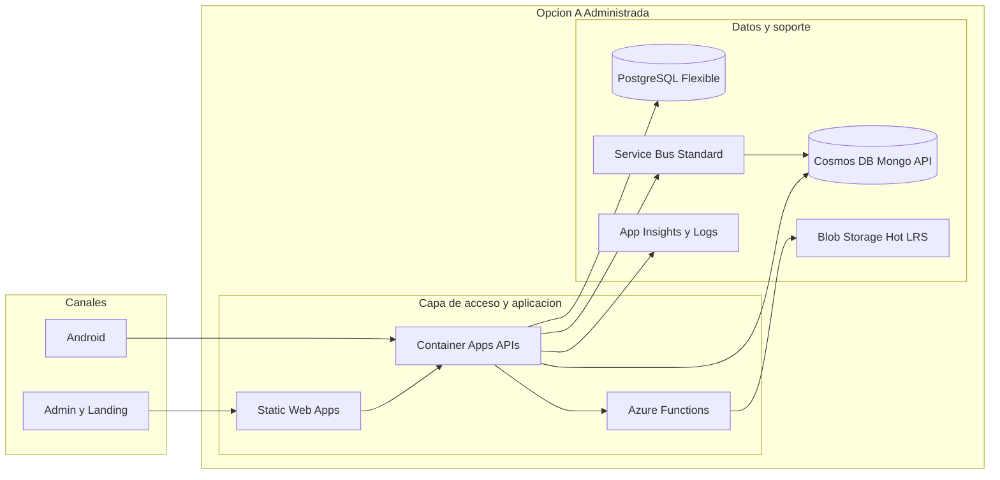
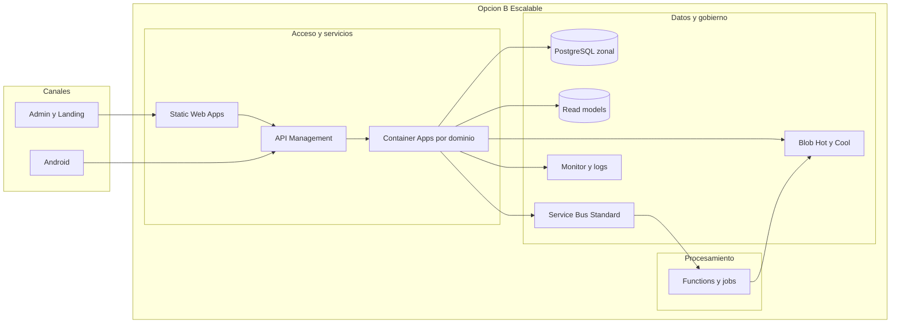
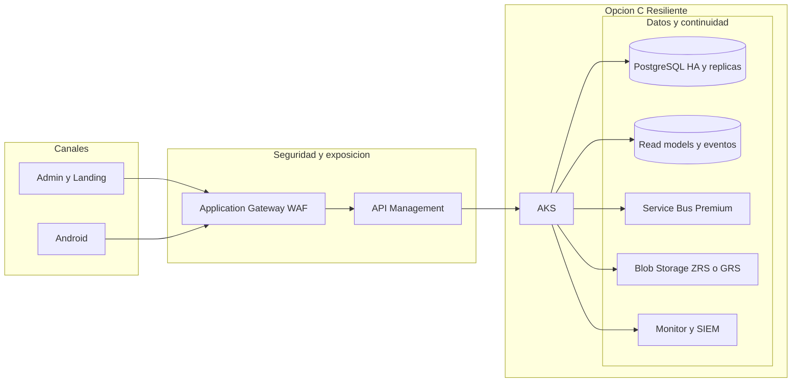
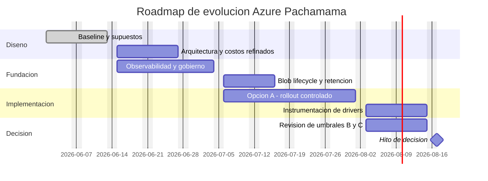

# Arquitectura Cloud y Plan de Escalamiento Azure para Pachamama SaaS

**Proyecto:** Pachamama SaaS  
**Fecha:** 2026-04-21  
**Proveedor principal:** Azure  
**Version:** 1.2  
**Fuente base:** Brief de Proyeccion de Costos Azure 2026-04-21  
**Preparado por:** GitHub Copilot - Arquitecto Cloud Expert

## Resumen Ejecutivo

Pachamama necesita una arquitectura Azure que no solo soporte el crecimiento tecnico del producto, sino que permita explicar el costo cloud en terminos que negocio pueda conectar con sus ingresos. El brief inicial ya definio el problema central: distinguir costos fijos, escalables y por uso, y relacionarlos con clientes, comunidades, recolectores, actividades y evidencia multimedia. A esa base ahora se suma una proyeccion de negocio 2026-2030 que lleva la plataforma desde **13 clientes y 7,800 recolectores en 2026** hasta **84 clientes y 46,800 recolectores en 2030**.

La recomendacion de esta revision es no saltar directamente a una arquitectura robusta de alto costo base. El mejor punto de partida es una **Opcion A administrada y gobernable**, apoyada en servicios PaaS y serverless, con instrumentacion desde el dia uno para medir los drivers reales de costo. Sobre esa base, se definen umbrales concretos para evolucionar a una **Opcion B escalable** y, solo cuando exista justificacion operativa o contractual, a una **Opcion C resiliente** con componentes de mayor costo fijo como Application Gateway WAF, AKS y Service Bus Premium.

El hallazgo mas importante para negocio es que, con la informacion hoy disponible, el costo que mas facilmente puede conectarse a los ingresos no es el compute base, sino el crecimiento acumulado de **Blob Storage, retencion, replicas y observabilidad**. El compute base marca el piso de operacion, pero la retencion de multimedia y la necesidad de resiliencia son las variables que mas cambian la estructura economica cuando el negocio madura. Cuando se propaga esa logica al costo total de plataforma, el **escenario base escalado** pasa de **USD 606.97/mes en 2026** a **USD 2,327.05/mes en 2030**, lo que vuelve mas concreto el momento en que conviene permanecer en Opcion A o migrar hacia Opcion B/C.

Esta version ya no funciona como brief. Funciona como **entregable arquitectonico inicial**, con opciones A/B/C, tabla comparativa, plan de implementacion, roadmap, riesgos y recomendacion final. El detalle numerico de drivers y formulas de costo se complementa en el anexo [AZURE-COSTOS-PACHAMAMA-DRIVERS-20260421.md](AZURE-COSTOS-PACHAMAMA-DRIVERS-20260421.md).

## Supuestos

| # | Supuesto | Implicancia |
|---|---|---|
| 1 | La region primaria recomendada para produccion es `brazilsouth`. | Favorece latencia regional para Peru/LATAM y concentra el costo en una sola region principal. |
| 2 | Firebase Auth, FCM y Twilio permanecen como integraciones externas. | La arquitectura Azure se enfoca en compute, datos, almacenamiento, mensajeria y gobierno. |
| 3 | El rango informado de 10 a 200 actividades por recolector por cliente se toma como unidad de observacion base para el modelo economico. | Si luego negocio confirma que ese rango es diario o semanal, el costo variable debe escalarse por frecuencia. |
| 4 | Cada actividad puede registrar entre 1 y 20 imagenes de menos de 1 MB y entre 1 y 5 videos de menos de 2 MB. | Blob Storage es el principal driver variable de almacenamiento operativo. |
| 5 | El producto seguira operando bajo un modelo multi-tenant logico, no con infraestructura dedicada por cliente en la etapa inicial. | Reduce costo base, pero obliga a mejor observabilidad y control de crecimiento por tenant. |
| 6 | El equipo necesita velocidad de salida y bajo peso operativo antes que complejidad de plataforma. | Favorece Container Apps, PostgreSQL Flexible, Blob Storage y Service Bus antes que AKS. |
| 7 | La demanda real aun no tiene suficiente historia para justificar una arquitectura enterprise desde el dia uno. | La evolucion debe activarse por umbrales medibles, no por intuicion. |

## Proyeccion de Crecimiento 2026-2030

La proyeccion comercial recibida de negocio cambia el nivel de precision del plan: ya no se esta trabajando solo con supuestos abiertos, sino con una curva anual que permite asociar etapas de arquitectura a hitos concretos de crecimiento.

| Anio | Clientes | Comunidades | Recolectores | Lotes activos |
|---|---|---|---|---|
| 2026 | 13 | 260 | 7,800 | 17,424 |
| 2027 | 23 | 500 | 15,000 | 45,504 |
| 2028 | 40 | 820 | 24,600 | 74,964 |
| 2029 | 61 | 1,180 | 35,400 | 106,392 |
| 2030 | 84 | 1,560 | 46,800 | 138,384 |

Lecturas de arquitectura:

- la relacion de **30 recolectores por comunidad** se mantiene estable en toda la curva;
- los lotes activos crecen mas rapido que los clientes, lo que refuerza la necesidad de observabilidad, politicas de retencion y lifecycle desde la etapa inicial;
- la discusion sobre Opcion B y Opcion C ya puede anclarse a anios y magnitudes concretas, no solo a criterios abstractos.

## Curva de Costo Escalado de Referencia

La siguiente tabla toma como referencia el anexo de costos y usa el **escenario base con plataforma escalada** para anclar las decisiones arquitectonicas a una curva economica verificable.

| Anio | Clientes | Recolectores | Lotes activos | Costo mensual base escalado | Costo anual base escalado | Costo mensual medio por cliente |
|---|---|---|---|---|---|---|
| 2026 | 13 | 7,800 | 17,424 | USD 606.97 | USD 7,283.59 | USD 46.69 |
| 2027 | 23 | 15,000 | 45,504 | USD 854.52 | USD 10,254.27 | USD 37.15 |
| 2028 | 40 | 24,600 | 74,964 | USD 1,402.16 | USD 16,825.89 | USD 35.05 |
| 2029 | 61 | 35,400 | 106,392 | USD 1,859.30 | USD 22,311.57 | USD 30.48 |
| 2030 | 84 | 46,800 | 138,384 | USD 2,327.05 | USD 27,924.56 | USD 27.70 |

Lectura de decision:

- hasta 2027 el costo escalado sigue en una banda que favorece sostener **Opcion A** con buen gobierno y medicion;
- el salto proyectado de 2028 lleva el costo base escalado por encima de **USD 1,400/mes**, punto en el que **Opcion B** deja de ser una mejora opcional y pasa a ser una decision de eficiencia operativa y gobierno;
- a partir de 2029-2030 la plataforma entra en una banda donde la discusion sobre **Opcion C** ya no debe verse como hipotetica, sino como una decision condicionada por SLA, compliance y costo del riesgo.

## Diagrama de Arquitectura

### Opcion A - Estandar Administrada

### Opcion B - Escalable Intermedia

### Opcion C - Alta Disponibilidad y Resiliencia

## Opciones Arquitectonicas

### Opcion A - Estandar Administrada

**Descripcion**  
Servicios PaaS y serverless con baja friccion operativa. Es la mejor opcion para iniciar la consolidacion Azure y medir drivers reales sin fijar una estructura de costo enterprise antes de tiempo.

**Componentes clave**

- Azure Static Web Apps para admin y landing.
- Azure Container Apps para APIs Java o containerizadas.
- Azure Functions para tareas puntuales y flujos event-driven.
- PostgreSQL Flexible Server como base operativa.
- Blob Storage Hot LRS con lifecycle desde el inicio.
- Service Bus Standard para sincronizacion y eventos.
- App Insights + Log Analytics para trazabilidad tecnica.

**Pros**

- Menor complejidad operacional.
- Time-to-market mas rapido.
- Permite medir el negocio antes de sobredimensionar infraestructura.
- Costos base razonables y componentes variables legibles.

**Contras**

- Menor aislamiento y menor capacidad de personalizacion avanzada.
- La resiliencia depende mas del diseno y la operacion que de la plataforma.
- No es la mejor opcion si se exige SLA contractual alto o topologia zero-trust desde el inicio.

**Complejidad operacional:** Baja  
**Costo base mensual estimado:** USD 250 a USD 450 + consumo variable  
**Banda de costo total de referencia:** hasta ~USD 855/mes en escenario base escalado 2026-2027  
**Recomendado para:** MVP comercial, primeras cohortes de clientes, captura de telemetria real y tramo 2026-2027.

### Opcion B - Escalable Intermedia

**Descripcion**  
Mantiene un enfoque administrado, pero separa mejor dominios, introduce gobierno de APIs y acelera la lectura de negocio mediante lifecycle de Blob, observabilidad mas fuerte y mejores controles de crecimiento.

**Componentes clave**

- Todo lo de Opcion A.
- API Management delante de APIs publicas.
- PostgreSQL con mayor capacidad, alta disponibilidad zonal y backups mejor gobernados.
- Blob Storage con politicas Hot/Cool y archivado controlado.
- Mayor segmentacion por dominio y colas.

**Pros**

- Mejor gobierno tecnico y mejor control de exposicion.
- Mayor elasticidad sin saltar aun a AKS.
- Sigue siendo relativamente manejable para un equipo pequeno.

**Contras**

- Mayor costo base.
- Requiere disciplina de observabilidad y administracion de APIs.
- Aumenta la cantidad de decisiones de plataforma a sostener.

**Complejidad operacional:** Media  
**Costo base mensual estimado:** USD 450 a USD 900 + consumo variable  
**Banda de costo total de referencia:** ~USD 1,402 a USD 1,859/mes en escenario base escalado 2028-2029  
**Recomendado para:** crecimiento sostenido, mayor volumen de sincronizacion, gobierno por dominio y tramo 2028-2029.

### Opcion C - Alta Disponibilidad y Resiliencia

**Descripcion**  
Arquitectura para una etapa madura del producto. El objetivo no es reducir costo, sino reducir riesgo operacional, reforzar seguridad perimetral, aislar workloads y soportar compromisos mas altos de continuidad.

**Componentes clave**

- AKS como plano de ejecucion principal.
- Application Gateway WAF y API Management.
- PostgreSQL con HA, replicas y DR mas formal.
- Service Bus Premium.
- Blob Storage con replicas mas robustas.
- Observabilidad reforzada y procesos formales de continuidad.

**Pros**

- Mayor resiliencia y gobierno de red.
- Mejor encaje para cargas altas, compliance y operaciones 24x7.
- Permite separar dominios y equipos con mayor libertad.

**Contras**

- Costo base significativamente mayor.
- Requiere madurez DevOps/SRE.
- Puede destruir margen si se activa antes de tener escala real o contratos que lo justifiquen.

**Complejidad operacional:** Alta  
**Costo base mensual estimado:** USD 1,800 a USD 3,200 + consumo variable  
**Banda de costo total de referencia:** desde ~USD 2,327/mes en escenario base escalado 2030, antes de sumar componentes enterprise  
**Recomendado para:** etapa madura, SLA contractual alto, necesidad de WAF, HA reforzada, topologia enterprise y tramo 2029-2030+ cuando el riesgo lo justifique.

## Tabla Comparativa

| Criterio | Opcion A | Opcion B | Opcion C |
|---|---|---|---|
| Costo base mensual estimado | USD 250 a 450 | USD 450 a 900 | USD 1,800 a 3,200 |
| Costo total base de referencia | hasta ~USD 855/mes | ~USD 1,402 a 1,859/mes | desde ~USD 2,327/mes |
| Complejidad operacional | Baja | Media | Alta |
| Escalabilidad | Media | Alta | Muy alta |
| Time-to-market | Rapido | Medio | Lento |
| SLA estimado | 99.5% a 99.9% | 99.9% | 99.9%+ |
| Gobierno tecnico | Bueno | Muy bueno | Alto |
| Lectura de costos para negocio | Alta | Alta | Media |
| Recomendado para | 2026-2027, inicio y medicion | 2028-2029, crecimiento sostenido | 2029-2030+, madurez y resiliencia |

## Desglose de Servicios

| Servicio / Recurso | Opciones | Naturaleza del costo | Referencia de precio | Justificacion |
|---|---|---|---|---|
| Azure Container Apps Standard | A, B | Semi-fijo + por uso | `vCPU activo 0.000024 USD/s`, `memoria activa 0.000003 USD/GiB-s`, `requests 0.4 USD/1M` en `brazilsouth` | Buen equilibrio entre elasticidad, gobierno y bajo peso operativo. |
| PostgreSQL Flexible Server | A, B | Semi-fijo + variable por storage y backup | `2 vCore = 0.1532 USD/h` en `brazilsouth` | Da piso operativo claro y es facil de asociar al core transaccional. |
| Blob Storage Hot LRS | A, B | Variable | `0.0489 USD/GB/mes` en `brazilsouth` | Es el principal costo que debe conectarse a evidencia multimedia y retencion. |
| Blob Operations | A, B | Variable | `0.00728 USD/10K operaciones` en `brazilsouth` | Relevante cuando crecen uploads, lecturas y lifecycle. |
| Service Bus Standard | A, B | Fijo base + variable | `10 USD/mes` base en `brazilsouth` | Desacopla sincronizacion y eventos sin costo base alto. |
| API Management | B, C | Fijo / semi-fijo | Validar en calculadora oficial | Mejora gobierno, seguridad y exposicion de APIs. |
| Application Gateway WAF | C | Fijo + capacidad | `0.4 USD/h` fijo + `0.008 USD/h` por capacidad en `brazilsouth` | Solo se justifica cuando la capa perimetral y WAF agregan valor real. |
| AKS Standard + Uptime SLA | C | Fijo alto | `0.6 USD/h` + `0.1 USD/h` en `brazilsouth` | Conviene solo en etapa madura o con requisitos enterprise. |
| Service Bus Premium | C | Fijo alto | `0.9275 USD/h` por Messaging Unit en `brazilsouth` | Mejora aislamiento, pero eleva fuerte el piso mensual. |
| Azure Cache for Redis | A, B, C | Semi-fijo | Precio no disponible via API; validar en calculadora | Util para performance, pero no debe explicar por si solo el pricing del cliente. |
| App Insights / Log Analytics | A, B, C | Variable por ingestion y retencion | Validar en calculadora | Debe gobernarse para que la observabilidad no se vuelva una fuga de margen. |

## Fases de Implementacion

| Fase | Objetivo | Entregables | Duracion sugerida | Criterio de salida |
|---|---|---|---|---|
| Fase 1 - Diseno y baseline | Confirmar supuestos, region, drivers y unidad economica | documento formal, formulas de costo, umbrales de evolucion | 2 semanas | negocio valida drivers y equipo valida opcion objetivo |
| Fase 2 - Fundacion | Dejar gobierno y medicion listos desde el inicio | observabilidad, naming, lifecycle de Blob, tableros por tenant | 2 a 3 semanas | costo y crecimiento se pueden medir por cliente y por driver |
| Fase 3 - Implementacion core | Desplegar Opcion A y estabilizar la operacion | compute, base de datos, storage, mensajeria, pipelines | 4 a 6 semanas | plataforma corre con trazabilidad operativa y sin fugas obvias de costo |
| Fase 4 - Revision y evolucion | Evaluar paso a Opcion B o C con evidencia | informe trimestral de costo, performance y riesgo | continua | la evolucion se decide por umbrales, no por percepcion |

### Hitos de Revision Alineados a la Proyeccion 2026-2030

| Hito | Magnitud proyectada | Lectura recomendada |
|---|---|---|
| Cierre 2026 | 13 clientes, 260 comunidades, 7,800 recolectores, 17,424 lotes activos | consolidar Opcion A y validar medicion por tenant con referencia de ~USD 606.97/mes en escenario base escalado |
| Cierre 2027 | 23 clientes, 500 comunidades, 15,000 recolectores, 45,504 lotes activos | revisar sizing de Opcion A y gobierno de Blob, logs y APIs con referencia de ~USD 854.52/mes |
| Cierre 2028 | 40 clientes, 820 comunidades, 24,600 recolectores, 74,964 lotes activos | punto formal de evaluacion para activar elementos de Opcion B con referencia de ~USD 1,402.16/mes |
| Cierre 2029 | 61 clientes, 1,180 comunidades, 35,400 recolectores, 106,392 lotes activos | decidir si Opcion B sigue siendo suficiente o si algun componente de Opcion C ya se justifica; referencia ~USD 1,859.30/mes |
| Cierre 2030 | 84 clientes, 1,560 comunidades, 46,800 recolectores, 138,384 lotes activos | evaluar Opcion C solo si la exigencia de SLA, riesgo o compliance la vuelve rentable; referencia ~USD 2,327.05/mes |

### Refinamiento Aplicado al Plan

El plan original del brief fue afinado en cuatro puntos:

1. La arquitectura robusta deja de verse como destino inmediato y pasa a ser una opcion condicionada por umbrales.
2. La estructura economica se separa en piso operativo, crecimiento por datos y costo de resiliencia.
3. Blob lifecycle, retencion y observabilidad pasan a ser decisiones de fundacion, no tareas posteriores.
4. El punto de control para decidir Opcion B o C se formaliza como una fase recurrente de revision.

## Roadmap Visual

## Riesgos y Mitigaciones

| Riesgo | Impacto | Mitigacion | Trigger de control |
|---|---|---|---|
| Activar Opcion C demasiado pronto | Destruye margen por alto costo fijo | Mantener Opcion A como baseline y revisar umbrales trimestralmente | costo base por cliente supera el margen objetivo |
| Retener multimedia en Hot Storage durante anos | Crecimiento silencioso del costo acumulado | Definir lifecycle Hot/Cool/Archive desde fundacion | crecimiento sostenido de GB retenidos por tenant |
| Observabilidad sin gobierno | Log Analytics puede crecer mas rapido que el core | politicas de retencion, filtros, muestreo y limpieza de payloads pesados | ingestion mensual superior a lo presupuestado |
| No distinguir frecuencia real del rango de actividades | Sub o sobreestimacion del costo variable | confirmar si el rango informado es diario, semanal o mensual | desviacion entre costo esperado y costo real |
| Usar AKS sin madurez DevOps | Riesgo tecnico y economico simultaneo | posponer AKS hasta tener necesidad probada y capacidad operativa | incidentes repetidos o necesidad contractual de mayor resiliencia |

## Recomendacion Final

La recomendacion es **implementar Opcion A como arquitectura base** y usar el anexo de costos para instrumentar el modelo economico por driver. Esta opcion entrega el mejor equilibrio entre costo, gobernabilidad y velocidad, y permite responder la principal necesidad de negocio: entender que parte del costo corresponde al piso operativo y que parte crece junto con clientes, recolectores, actividades y multimedia.

La evolucion a **Opcion B** debe considerarse cuando se observe al menos una combinacion de estos umbrales:

- acercamiento al tramo proyectado de **2028**: alrededor de 40 clientes, 820 comunidades y 24,600 recolectores;
- costo total base de referencia acercandose o superando la banda de **USD 1,400/mes** en el escenario base escalado;
- crecimiento sostenido de clientes y recolectores durante dos o tres ciclos de medicion;
- necesidad de API governance formal o mayor control de exposicion;
- crecimiento de Blob Storage o logs que justifique lifecycle mas sofisticado y dominios mas separados;
- mayor presion de concurrencia o sincronizacion.

La evolucion a **Opcion C** debe reservarse para cuando exista al menos una de estas condiciones:

- acercamiento al tramo proyectado de **2029-2030**: 61 a 84 clientes y 35,400 a 46,800 recolectores;
- costo total base de referencia acercandose o superando la banda de **USD 2,300/mes** en el escenario base escalado, antes de agregar componentes enterprise;
- SLA contractual superior a la tolerancia natural de una plataforma PaaS simple;
- necesidad de WAF, segmentacion de red y continuidad reforzada;
- presion regulatoria, auditoria o requisitos enterprise;
- costo de un incidente operativo supera claramente el mayor costo base mensual.

## Referencias

- Brief base: [ARQ-PACHAMAMA-AZURE-PROYECCION-COSTOS-20260421.md](ARQ-PACHAMAMA-AZURE-PROYECCION-COSTOS-20260421.md)
- Anexo de costos: [AZURE-COSTOS-PACHAMAMA-DRIVERS-20260421.md](AZURE-COSTOS-PACHAMAMA-DRIVERS-20260421.md)
- Arquitectura MVP vigente: [../MVP-ARCHITECTURE.md](../MVP-ARCHITECTURE.md)
- Inventario Azure actual: [../infrastructure/azure.md](../infrastructure/azure.md)
- Arquitectura Azure full previa: [ARQ-PACHAMAMA-AZURE-FULL-20260410-v2.md](ARQ-PACHAMAMA-AZURE-FULL-20260410-v2.md)