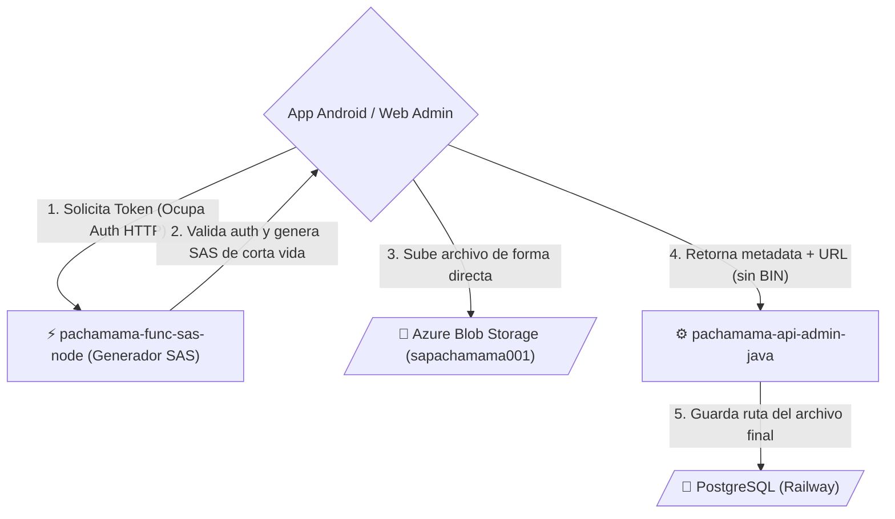

# Carga de Archivos (Tokens SAS)

Describe cómo las aplicaciones evitan convertirse en cuellos de botella para el backend principal, delegando la subida pesada de recursos binarios (fotos, PDFs, capturas) en la red de Azure a través de Shared Access Signatures (SAS) pre-firmadas.

## Diagrama de Comunicación Blob

## Resumen Operativo

1. **Permiso Previo**: En vez de que un usuario suba 5MB de foto directamente al pachamama-api-admin-java (lo cual ocuparía RAM, hilos del server de java y ancho de banda intermediario), el cliente llama primero a la función liviana pachamama-func-sas-node solicitando permiso para subir un archivo.
2. **Firma**: La Azure Function revisa las credenciales de Firebase, y si son correctas, usa el SDK de Azure para emitir un link especial y temporal con permisos únicos (e.g. Válido por 10 minutos para el folder dmin-uploads).
3. **Carga Directa**: La App Android dispara el PUT Request directamente a la URL masiva y rápida de Azure Blob Storage omitiendo pasar sus binarios por otro lado.
4. **Acoplamiento Limpio**: Finalizada la subida en el celular o la web, el dispositivo llama ahora sí a la API principal pero únicamente entregándole un texto liviano: "fotoUrl": "https://sapachamama001.blob.core.windows.net/.../x.jpg". Este texto es lo único que se guarda en PostgreSQL.
