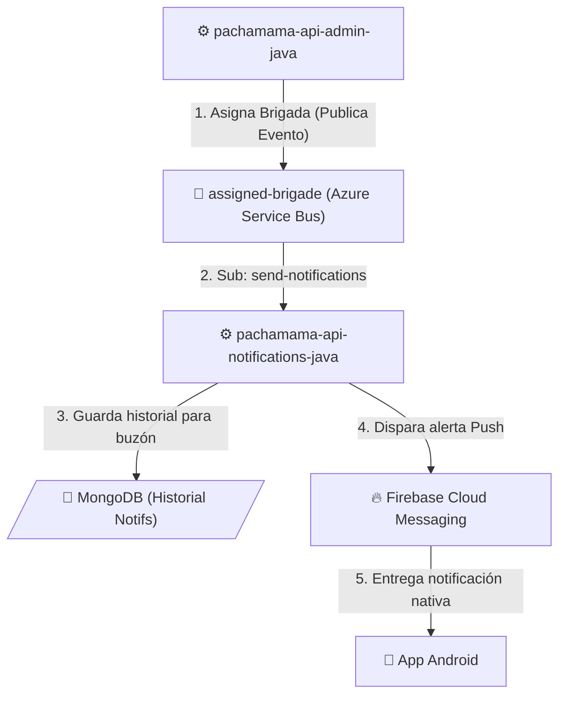

# Flujo de Notificaciones

Este flujo define cómo el ecosistema envía alertas en tiempo real (Push) al dispositivo Android o paneles, por ejemplo cuando ocurren acciones administrativas (un administrador web le asigna una nueva brigada al técnico recolector).

## Diagrama de Flujo

## Resumen Operativo

1. **Gestión Web**: El supervisor usando la Web de Administración despacha una asignación hacia un operario. La principal API pachamama-api-admin-java valida esto y, tras guardar en PostgreSQL, emite el evento al bus.
2. **Propagación Segura**: La API exclusiva de Notificaciones (pachamama-api-notifications-java) esta constantemente escuchando (mediante suscripción send-notifications). Reacciona al momento reconociendo al destinatario.
3. **Persistencia**: Se almacena un registro o copia de carbón del evento en MongoDB, lo que permite que el usuario tenga una "bandeja de entrada / campanita" en la App o la Web aún si borra la push.
4. **Ejecución Push**: El microservicio emite un API POST estándar hacia el núcleo de FCM en Google, quien de manera transparente enruta la alerta a la pantalla del recolector en el campo.
