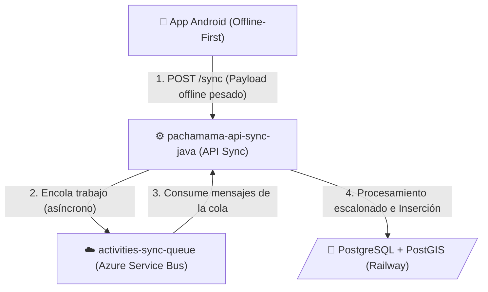

# Sincronización Offline de Actividades

Este flujo describe cómo la **aplicación móvil de Android** (que opera de forma *offline-first* o sin conexión a internet en el campo) reporta y sincroniza la recolección de datos y actividades una vez que el dispositivo recupera la conexión.

## Diagrama de Sincronización

## Resumen Operativo

1. **Recolección Offline**: El usuario en campo recaba métricas e imágenes (pachamama-mobile-android), almacenándolas en el motor local del celular.
2. **Reconexión**: Al volver la red, la App envía de golpe el bloque de tareas al pachamama-api-sync-java.
3. **Desacoplamiento**: Para evitar encolar las conexiones HTTP por las cargas masivas o picos inusuales, el API-Sync toma ese payload y lo empaca dentro de la cola del **Azure Service Bus** (activities-sync-queue), liberando al celular del estado de carga inmediatamente.
4. **Persistencia Final**: Posteriormente (e inmediatamente después en background), un proceso consumidor del mismo API extrae esa cola de trabajos uno por uno, realiza el mapeo, las validaciones espaciales, y guarda de forma segura los resultados finales en la base de datos núcleo en Railway (PostgreSQL + PostGIS).
