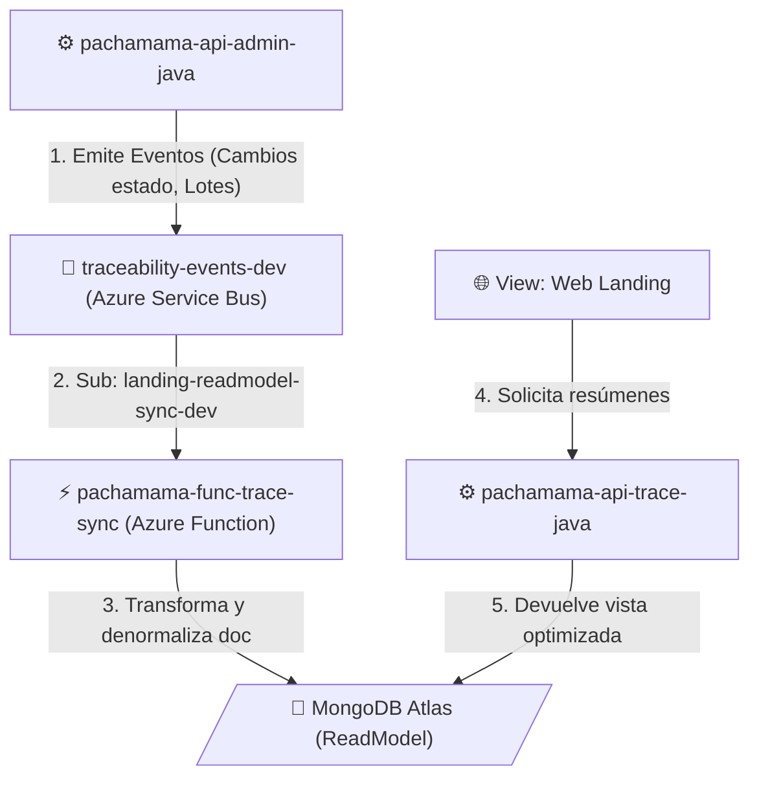

# Trazabilidad y Consolidación ReadModel (CQRS)

Este flujo describe cómo se propagan los eventos núcleo originados en el sistema de administración relacional, hacia una base de datos orientada a lectura rápida (NoSQL) diseñada de manera exclusiva para optimizar el consumo de la web pública (Landing Page).

## Diagrama de Flujo

## Resumen Operativo

1. **Emisión de Eventos**: Cada vez que un inspector cambia el estado de un lote o certifica una unidad vía el backend principal (pachamama-api-admin-java), este emite un mensaje de que un "evento de trazabilidad" ha ocurrido y lo envía al tópico global en Azure .
2. **Reacción Serverless**: La función de Azure interviene en el momento exacto (pachamama-func-trace-sync), suscrita al canal landing-readmodel-sync-dev, recoge el evento.
3. **Persistencia (Denormalización)**: La función de Azure toma estos datos y forma documentos planos, unificados y listos para leer en MongoDB, eliminando la necesidad de realizar joins (JOIN) como ocurriría en bases transaccionales, evitando saturar la base central operativa.
4. **Consumo de la Landing**: Cuando los usuarios ingresan a la app de destino (pachamama-web-landing), solicitan la información y el API encargada (pachamama-api-trace-java) simplemente despacha los JSON cacheados y optimizados formados por el serverless en MongoDB.
