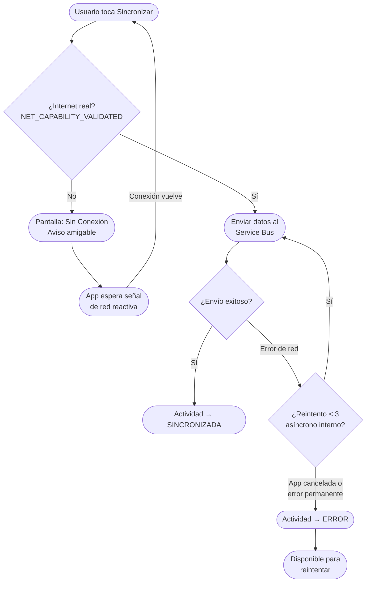

# Gestión de Cambios: Observación de Sincronización — Validación de Conectividad y Robustez Offline

## Registro de Cambios

---

## [10 Abr 2026] Validación de Conectividad y Robustez de Sincronización

**Autor:** Jecri Do Santos
**Período:** 10 de Abril 2026 *(1 día)*
**APK generada:** `v1.2.2`

**Objetivo:** Evitar que la app intente sincronizar cuando no hay conexión a internet real, previniendo los errores visibles de "3 intentos fallidos" que eran causados por problemas de conectividad y no por fallos del sistema.

### Contexto

Los recolectores de campo reportaban visualizar errores de sincronización tras 3 intentos fallidos. Al investigar, se detectó que el origen no era un error de la aplicación ni de los servicios centrales, sino problemas de conectividad real: el dispositivo aparecía conectado (WiFi o datos) pero sin acceso efectivo a internet (por ejemplo, conectado a una red WiFi sin salida a internet, o con señal inestable en zonas rurales).

Adicionalmente, cuando la sincronización era interrumpida abruptamente por Android (app cerrada en background), las actividades quedaban permanentemente en estado "Sincronizando…", sin posibilidad de reintentar en un ciclo posterior.

> **Observación:** El usuario miraba error de sincronización en 3 intentos fallidos, pero se detectó que fue error de conexión. Se evita que se sincronice cuando no hay conexión.

---

### Componentes Modificados

| Componente | Versión | Descripción del Cambio |
|---|---|---|
| [Mobile Android](pachamama-mobile-android.md) | `v1.2.1` → `v1.2.2` | Validación estricta de conectividad real, reintentos internos, protección `NonCancellable` y mejoras de telemetría |

---

### Flujo del Cambio — Sincronización con Validación de Conectividad

---

### Particularidades Técnicas

- **Validación `NET_CAPABILITY_VALIDATED`:** La app ya no confía únicamente en el estado de red que reporta Android. Verifica que el SO haya confirmado conectividad efectiva hacia internet, evitando falsas esperanzas al recolector.
- **Eliminación de límite estricto de intentos:** Se quitó la restricción de máximo `n/3` intentos globales. El botón "Sincronizar Todo" siempre estará disponible para el usuario, sin importar cuántas veces falle la red.
- **Discriminador `syncSource`:** El log de telemetría ahora indica si el fallo ocurrió en uso manual (`MANUAL`) o por tarea automatizada en background (`WORKER`), mejorando el diagnóstico desde operaciones o TI.
- **Categorización de errores de red:** Los errores `Connection reset` se etiquetan como `NETWORK_ERROR` separándolos de `FATAL_SYNC_ERROR`, para distinguir problemas temporales de red vs. fallos del sistema central.
