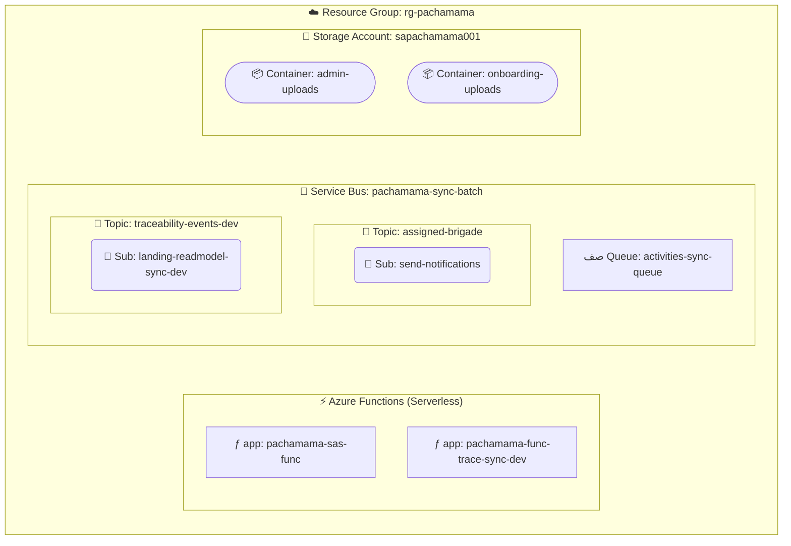

# Plataforma Azure (MVP / Pre-Producción)

La infraestructura cloud de **Microsoft Azure** hospeda los servicios asíncronos, almacenamiento de objetos y plataforma serverless de la arquitectura.

## Detalles de Cuenta y Entorno

- **Directorio Administrador (Tenant):** Code on Cube (codeoncube.onmicrosoft.com)
- **Cuenta Administradora:** jecridosantos@outlook.com
- **Suscripción ID:** 861f9b3c-5400-46a9-bde2-d8139428c7ee
- **Grupo de Recursos (Resource Group):** 
rg-pachamama

---

## Topología de Recursos

---

- **Uso:** Almacenamiento seguro de archivos. Todo el acceso directo se gobierna mediante URLs con tokens SAS.
- **Contenedores:**
  - admin-uploads: Archivos procesados por la web de administración e imágenes de actividades provenientes de la app de Android.
  - onboarding-uploads: Fotos y capturas exclusivas del proceso de onboarding desde el app de Android.

### 2. Azure Service Bus (Mensajería)
- **Namespace:** pachamama-sync-batch
- **Región (Location):** brazilsouth
- **SKU:** Standard
- **Uso:** Comunicación asíncrona, patrón publicador-suscriptor (Pub/Sub) y encolamiento de trabajos para consistencia eventual.
- **Colas (Queues):**
  - activities-sync-queue: Usada por la API Sync para encolar el flujo de actividades hechas offline por recolectores en campo.
- **Tópicos (Topics) y Suscripciones:**
  - assigned-brigade
    - **Suscripción:** send-notifications (Integrado típicamente para disparar alertas y push).
  - 	raceability-events-dev
    - **Suscripción:** landing-readmodel-sync-dev (Consumida por la function de trazabilidad de CQRS).

### 3. Azure Functions (Serverless OS)

Las aplicaciones serverless desplegadas se ejecutan bajo planes de alojamiento dinámicos de consumo.

**A. Función de Autorización de Almacenamiento**
- **Nombre:** pachamama-sas-func
- **Nombre futuro (PRD):** func-pachamama-sas-prd
- **Región:** eastus (Plan EastUSPlan - Dynamic)
- **Propósito:** Valida la petición de un usuario para proporcionarle un token de acceso seguro por tiempo limitado para manipulación directa del blob storage evitando intermediar el payload por la API.
- **Configuración CORS** *(requerida en ambas instancias — actual y futura)*:

  | Origen Permitido | Entorno |
  |---|---|
  | `https://app.pachamama.eco` | Producción |
  | `https://web-admin-pachamama.vercel.app` | Pre-Producción / MVP |
  | `http://localhost:4200` | Desarrollo Local |

**B. Función Sincronizadora CQRS (ReadModel)**
- **Nombre:** pachamama-func-trace-sync-dev
- **Región:** centralus (Plan ASP-rgpachamama-9a4c - Dynamic)
- **Propósito:** Escucha en el service bus la suscripción landing-readmodel-sync-dev, consolida los eventos provenientes del Admin o el Sync API, y reescribe de forma paralela los resúmenes en la base de datos MongoDB Atlas para optimizar las consultas de la landing web pública.

---

## Referencias Arquitectónicas y Próximos Pasos (Migración/Escala)

- **Estandarización Regional:** Es notable que el entorno se reparte en al menos tres regiones (eastus para Blob, razilsouth para Service Bus y centralus en serverless). En caso de migrar localizaciones u orientarse hacia un ambiente escalable, es importante agruparlos en una misma región para disminuir la latencia interna así como los costos de red entre centros de datos (Egress).
- **Service Bus SKU y Escalamiento:** El nivel "Standard" permite un control básico e ideal para el MVP. A nivel enterprise es posible migrar a Premium para asignación de recursos y soporte para Private Endpoints de ser requerido.
- **Gestión Multi-Ambiente:** El sufijo -dev indica la existencia de un ecosistema en temprano desarrollo. Para entornos productivos se recomienda utilizar IaC (Infrastructure as Code) a través de herramientas nativas de Azure (Bicep o ARM).
