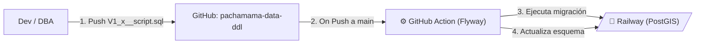

# Base de Datos Relacional y Geográfica (Railway)

El núcleo transaccional y operativo del backend de Pachamama se concentra en una base de datos relacional robustecida con capacidades de análisis geoespacial, actualmente alojada y gestionada dentro de la plataforma PaaS **Railway**.

## Configuración y Credenciales

- **Cuenta Propietaria:** pachamamadev@gmail.com
- **Proveedor:** Railway
- **Tecnología Base:** PostgreSQL 16
- **Imagen Docker de Origen:** postgis/postgis:16-master *(Incluye la extensión PostGIS para cálculo de áreas, parcelas y polígonos)*

## Infraestructura y Recursos (MVP)

- **Región (Location):** US East (Virginia, USA)
- **Host / Nodo Público:** switchback.proxy.rlwy.net
- **Puerto:** 34238
- **Capacidad Asignada (Límites de Réplica):** 
  - **CPU:** 8 vCPU
  - **Memoria RAM:** 8 GB
- **Arquitectura de Réplica:** Sin réplicas (Single Instance) para este ambiente pre-productivo.

---

## Estrategia de Aprovisionamiento y Migración Continua

La creación, actualización de tablas y control de versiones del modelo transaccional es **estrictamente automatizada**. Ningún acceso directo de administrador se utiliza para manipular el esquema.

- **Repositorio Especializado:** [pachamama-data-ddl](https://github.com/pachamamadev-pe/pachamama-data-ddl)

Este repositorio almacena todos los scripts .sql. Para realizar la integración, se utiliza **Flyway** como motor controlador de versiones de la base de datos (Migrations), montado estructuralmente en flujos de **GitHub Actions** (\.github\workflows\deploy-to-railway.yml\).

### Ciclo de vida del esquema de base de datos

### Tabla de Secretos del Workflow (GitHub Secrets)

Para que *Flyway* logre aprovisionar y conectarse de forma segura sin exponer credenciales, el repositorio pachamama-data-ddl debe tener configurados los siguientes secretos:

#### Capa de Conexión
- RAILWAY_DB_HOST: Host proporcionado en la consola de Railway (Ej: *switchback.proxy.rlwy.net*).
- RAILWAY_DB_PORT: Puerto activo (*34238*).

#### Credenciales Administrador (Root/Aprovisionamiento)
*Solo usado por Flyway para la creación de esquemas.*
- RAILWAY_ROOT_DB
- RAILWAY_ROOT_USER
- RAILWAY_DB_PASSWORD

#### Credenciales Aplicación (Usuarios y Restricciones)
*Variables inyectadas para creación de usuarios que finalmente utilizan las APIs de Java para leer la BD.*
- PACHAMAMA_DB_NAME
- PACHAMAMA_DB_USER
- PACHAMAMA_DB_PASSWORD

---

## Notas de Evolución / Migración

> **Recomendaciones a futuro:** Aunque la infraestructura de Railway (8vCPUs y 8GB) es bastante fuerte para una escala media, carece de réplicas de lectura (Read-Replicas) integradas de forma nativa frente a caídas temporales. Cuando se pase a un ambiente productivo en **Azure**, la migración natural de este clúster sería mover estos datos a **Azure Database for PostgreSQL - Flexible Server** con PostGIS habilitado en la región *East US*; esto con la intención de reducir a 0 ms la latencia de acceso entre el *App Service* / *Functions* y la base de datos relacional que operan en el ecosistema Azure.
